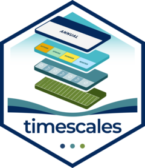

<!-- README.md is generated from README.Rmd. Edit THIS file, then knit:
     devtools::build_readme()  (or knitr::knit("README.Rmd"))          -->

```{r, include = FALSE}
knitr::opts_chunk$set(
  collapse = TRUE,
  comment = "#>",
  fig.path = "man/figures/README-",
  out.width = "100%",
  dpi = 110
)
# the hero uses the Global Wind Atlas palette from energypal
has_pal <- requireNamespace("energypal", quietly = TRUE)
```

# timescales <a href="https://optimal2050.github.io/timescales/r/"></a>

<!-- badges: start -->
[](https://github.com/optimal2050/timescales/actions/workflows/R-CMD-check.yaml)
[](https://github.com/optimal2050/timescales/actions/workflows/test-coverage.yaml)
[](https://github.com/optimal2050/timescales/actions/workflows/lint.yaml)
[](https://lifecycle.r-lib.org/articles/stages.html#experimental)
<!-- badges: end -->

## Overview

timescales provides **nested timeframes and calendars** for optimization
and simulation models: organize the time dimension of your model data,
convert it between resolutions, and see every level at once.

- [`calendar()`](https://optimal2050.github.io/timescales/r/reference/calendar_build.html)
  builds a `Calendar` — ordered timeframes, their members, and one
  leaftable row per timeslice with duration-proportional shares; 43
  curated designs, from `d365_h24` to typical-period compressions and
  fiscal years, ship pre-built in
  [`calendars`](https://optimal2050.github.io/timescales/r/reference/calendars.html).
- [`join_calendar()`](https://optimal2050.github.io/timescales/r/reference/join_calendar.html)
  decorates a table keyed by timeslices with the calendar's label and
  share/weight columns — your tables stay tables (data.frame, tibble,
  data.table, dtplyr/arrow in; the same class out).
- [`recast_calendar()`](https://optimal2050.github.io/timescales/r/reference/recast_calendar.html)
  converts values between any two calendars — one rule per value
  column, totals conserved, up or down.
- [`filter_calendar()`](https://optimal2050.github.io/timescales/r/reference/filter_calendar.html)
  and
  [`prune_calendar()`](https://optimal2050.github.io/timescales/r/reference/prune_calendar.html)
  carve partial-year samples and coarser designs for model runs.
- [`geom_calendar()`](https://optimal2050.github.io/timescales/r/reference/geom_calendar.html),
  [`calendar_autoplot()`](https://optimal2050.github.io/timescales/r/reference/calendar_autoplot.html)
  and friends draw any level: heatmaps, wall calendars, icicles, and
  axonometric stacks.

timescales is the time-domain package of the
[optimal2050](https://github.com/optimal2050) modeling stack; its
spatial companion,
[geoscales](https://github.com/optimal2050/geoscales), shares the same
design and vocabulary.

If you are new to timescales, the best place to start is the
[get-started vignette](https://optimal2050.github.io/timescales/r/articles/timescales.html)
(`vignette("timescales")`).

## Installation

timescales is not on CRAN yet; install the development version from
GitHub:

```r
# install.packages("pak")
pak::pkg_install("optimal2050/timescales")
```

## Usage

One `Calendar`, three resolutions of the same year: Reykjavik's hourly
wind (NASA MERRA-2, 2019) on the `m12_h24` calendar — the annual mean on
top, months in the middle, the full month-by-hour texture at the bottom,
every plane on one shared wind-speed scale. Its spatial twin — Iceland's
wind resource on the map — opens the
[geoscales README](https://github.com/optimal2050/geoscales).

```{r hero-reykjavik-wind, eval = has_pal, fig.width = 8, fig.height = 3.6, dpi = 300, message = FALSE}
library(timescales)
library(dplyr, warn.conflicts = FALSE)

cal  <- calendars$m12_h24
wind <- merra2_cities |>
  filter(city == "Reykjavik") |>
  mutate(timeslice = datetime_to_timeslice(datetime, cal)) |>
  summarise(W50M = mean(W50M), .by = timeslice)

calendar_autoplot(cal, type = "stack",
                  data = wind, z = "W50M",
                  rule = "weighted_mean", year = 2019,
                  labels = "MONTH",
                  colour = c("grey35", "grey35", NA),  # no borders on the
                  frame = TRUE,                        # dense HOUR plane
                  frame_fill = ggplot2::alpha("#6FA8DC", 0.15)) +
  energypal::scale_fill_energy_b(limits = c(3.5, 10)) +
  ggplot2::labs(fill = "m/s at 50m")
```

Datetime data lands on any calendar as one ggplot2 layer — the same wind
year at its full 365 x 24 resolution:

```{r demo-heatmap, fig.width = 8, fig.height = 3, message = FALSE}
library(ggplot2)
rey <- merra2_cities |> filter(city == "Reykjavik")

ggplot(rey) +
  geom_calendar(calendar = calendars$d365_h24,
                datetime = "datetime", z = "W50M") +
  scale_fill_viridis_c(option = "G") +
  scale_x_discrete(breaks = calendar_breaks(10)) +
  scale_y_discrete(breaks = calendar_breaks()) +
  labs(x = "day of year", y = "hour", fill = "m/s",
       title = "Reykjavik wind on the d365_h24 calendar") +
  theme_calendar()
```

And a familiar wall calendar is just another calendar design — here the
same city's temperature:

```{r demo-wall, fig.width = 8, fig.height = 5.5, message = FALSE}
calendar_wall_plot(calendar("m12_md365"), rey, z = "T10M", year = 2019) +
  scale_fill_viridis_c(option = "C") +
  labs(fill = "degC", title = "Reykjavik temperature as a wall calendar")
```

*Weather data: NASA MERRA-2 reanalysis (Global Modeling and Assimilation
Office) — public domain; extracted with
[merra2ools](https://github.com/optimal2050/merra2ools).*

## Learning more

- The [get-started vignette](https://optimal2050.github.io/timescales/r/articles/timescales.html)
  — build, inspect, convert, visualize, in 5 minutes.
- [Types of calendars](https://optimal2050.github.io/timescales/r/articles/calendars.html)
  — the 43-design catalog, from full resolution to typical periods.
- [Visualization](https://optimal2050.github.io/timescales/r/articles/visualization.html)
  — heatmaps, wall calendars, profiles, ribbons, and duration curves on
  real weather data.
- The [project site](https://optimal2050.github.io/timescales/) — entry
  point for all language flavours — and the
  [R reference](https://optimal2050.github.io/timescales/r/reference/).

## Getting help

timescales is pre-1.0 and APIs may still change between minor versions.
Questions, feedback, and bug reports are welcome on the
[issue tracker](https://github.com/optimal2050/timescales/issues); see
[CONTRIBUTING](CONTRIBUTING.md) for the repository layout and the
multi-language roadmap.

## License

Apache-2.0. See [LICENSE](LICENSE) and [NOTICE](NOTICE).
