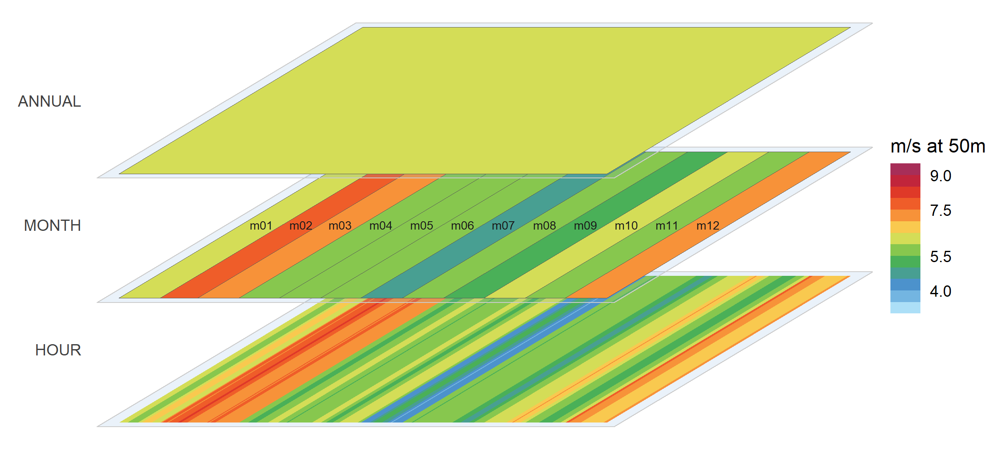

<!-- README.md is generated from README.Rmd. Edit THIS file, then knit:
     devtools::build_readme()  (or knitr::knit("README.Rmd"))          -->

# timescales <a href="https://optimal2050.github.io/timescales/r/"></a>

<!-- badges: start -->

[](https://github.com/optimal2050/timescales/actions/workflows/R-CMD-check.yaml)
[](https://github.com/optimal2050/timescales/actions/workflows/test-coverage.yaml)
[](https://github.com/optimal2050/timescales/actions/workflows/lint.yaml)
[](https://lifecycle.r-lib.org/articles/stages.html#experimental)
<!-- badges: end -->

> Nested timeframes and calendars for optimization and simulation
> models.

One `Calendar`, three resolutions of the same year: Reykjavik’s hourly
wind (NASA MERRA-2, 2019) on the `m12_h24` calendar — the annual mean on
top, months in the middle, the full month-by-hour texture at the bottom,
every plane on one shared wind-speed scale. Its spatial twin — Iceland’s
wind resource on the map — opens the [geoscales
README](https://github.com/optimal2050/geoscales).

``` r
library(timescales)
library(dplyr, warn.conflicts = FALSE)

cal  <- calendars$m12_h24
wind <- merra2_cities |>
  filter(city == "Reykjavik") |>
  mutate(timeslice = datetime_to_timeslice(datetime, cal)) |>
  summarise(W50M = mean(W50M), .by = timeslice)

calendar_autoplot(cal, type = "stack",
                  data = wind, z = "W50M",
                  rule = "weighted_mean", year = 2019,
                  labels = "MONTH",
                  colour = c("grey35", "grey35", NA),  # no borders on the
                  frame = TRUE,                        # dense HOUR plane
                  frame_fill = ggplot2::alpha("#6FA8DC", 0.15)) +
  energypal::scale_fill_energy_b(limits = c(3.5, 10)) +
  ggplot2::labs(fill = "m/s at 50m")
```



*Weather data: NASA MERRA-2 reanalysis (Global Modeling and Assimilation
Office) — public domain; extracted with
[merra2ools](https://github.com/optimal2050/merra2ools).*

## What timescales offers

`timescales` is the **time-domain** package of the optimal2050 modeling
stack (its spatial companion is
[`geoscales`](https://github.com/optimal2050/geoscales)):

- **Organize model data in nested time structures** — a `Calendar` is
  ordered timeframes, their members, and one leaftable row per timeslice
  with duration-proportional shares.
- **Reshape between calendars** — recast up or down with explicit rules
  and conserved totals; joins decorate your tables instead of replacing
  them.
- **Your tables stay tables** — data.frame, tibble, or data.table in,
  the same class out; dtplyr/arrow queries stay lazy. Keep the data in
  csv, R data files, or arrow/parquet — the package never owns a storage
  format.
- **Flexible model design** — pick the timeframes a model run needs;
  prune and filter partial-year subsets; representative typical-period
  designs ship in the 43-calendar catalog.
- **See every level** — calendar heatmaps, wall calendars, icicles, and
  axonometric stacks, all data-aware and multi-level.

This is a **multi-language** project. The R package is the current focus
(Phase 1); a C++ core (Phase 2) and a Python port (Phase 3) are planned.

## Quick demo

A **Calendar** is a named slicing of the year — 43 curated designs ship
pre-built in the `calendars` catalog, from `d365_h24` down to
typical-period compressions and April-anchored fiscal years
(`calendar("m12")` builds any of them fresh). Inside: one leaftable row
per timeslice, with duration-proportional shares:

``` r
library(timescales)

cal <- calendars$m12
cal
#> Calendar: m12 
#> Timeframes (1):
#>   - MONTH (12) [token: m12]
#> Leaf timeslices: 12
#> year_fraction: 1
#> year_start: month=1, day=1
#> utc_offset_minutes: 0
head(cal@leaftable, 3)
#>   MONTH      share weight timeslice
#> 1   m01 0.08493151    744       m01
#> 2   m02 0.07671233    672       m02
#> 3   m03 0.08493151    744       m03
```

Key your data by its timeslices and the calendar decorates the table —
`join_calendar()` attaches the label and share/weight columns under the
calendar’s own name:

``` r
monthly <- data.frame(
  timeslice = cal@leaftable$timeslice,
  load = c(120, 118, 105, 92, 85, 88, 95, 100, 98, 90, 105, 122)
)

monthly |> join_calendar(cal, meta = TRUE) |> head(3)
#>   timeslice load m12  m12.share m12.weight
#> 1       m01  120 m01 0.08493151        744
#> 2       m02  118 m02 0.07671233        672
#> 3       m03  105 m03 0.08493151        744
```

Converting between two calendars is one verb, with one rule per value
column and conserved totals:

``` r
monthly |>
  recast_calendar(from = cal, to = calendar("q4"),
                  year = 2025, rule = "weighted_mean", by = "day")
#>   timeslice      load
#> 1        Q1 114.21111
#> 2        Q2  88.29670
#> 3        Q3  97.66304
#> 4        Q4 105.67391
```

Datetime data lands on a calendar as one ggplot2 layer
(`geom_calendar()`) — here Reykjavik’s wind year at full hourly
resolution — and the same weather draws as a wall calendar:

``` r
library(ggplot2)
rey <- merra2_cities |> filter(city == "Reykjavik")

ggplot(rey) +
  geom_calendar(calendar = calendars$d365_h24,
                datetime = "datetime", z = "W50M") +
  scale_fill_viridis_c(option = "G") +
  scale_x_discrete(breaks = calendar_breaks(10)) +
  scale_y_discrete(breaks = calendar_breaks()) +
  labs(x = "day of year", y = "hour", fill = "m/s",
       title = "Reykjavik wind on the d365_h24 calendar") +
  theme_calendar()
```


``` r
calendar_wall_plot(calendar("m12_md365"), rey, z = "T10M", year = 2019) +
  scale_fill_viridis_c(option = "C") +
  labs(fill = "degC", title = "Reykjavik temperature as a wall calendar")
```


And the structure figures carry data too: the icicle fills every band
with the value recast to that band’s resolution — the same recast
machinery that converts your model tables:

``` r
wind <- rey |>
  mutate(timeslice = datetime_to_timeslice(datetime, calendars$m12_h24)) |>
  summarise(W50M = mean(W50M), .by = timeslice)

calendar_autoplot(calendars$m12_h24, data = wind, z = "W50M",
                  rule = "weighted_mean", year = 2019) +
  labs(fill = "m/s")
```


See `vignette("timescales")` for the 5-minute tour, and the
[visualization
article](https://optimal2050.github.io/timescales/r/articles/visualization.html)
for heatmaps, profiles, ribbons, and duration curves on real weather
data.

## Documentation

- **[Project site](https://optimal2050.github.io/timescales/)** — entry
  point for all language flavours
- **[R reference and
  articles](https://optimal2050.github.io/timescales/r/)**

## Status

🚧 In development — pre-1.0, APIs may still change between minor
versions. Feedback and issues are welcome.

## Installation

``` r
# From GitHub
remotes::install_github("optimal2050/timescales")
```

Or via [r-universe](https://optimal2050.r-universe.dev/):

``` r
install.packages("timescales", repos = "https://optimal2050.r-universe.dev")
```

## Repository layout

    timescales/
    ├── DESCRIPTION, NAMESPACE, R/, man/, tests/, vignettes/   # R package (root)
    ├── inst/include/timescales/                               # C++ headers (Phase 2)
    ├── src/                                                   # Rcpp glue (Phase 2)
    ├── cpp/                                                   # standalone C++ core (Phase 2)
    ├── python/                                                # Python package (Phase 3)
    ├── docs/                                                  # unified Quarto site
    ├── specs/                                                 # cross-language golden tests
    ├── benchmark/                                             # cross-language benchmarks
    └── .github/workflows/                                     # CI

## License

Apache-2.0. See [LICENSE](LICENSE) and [NOTICE](NOTICE).
