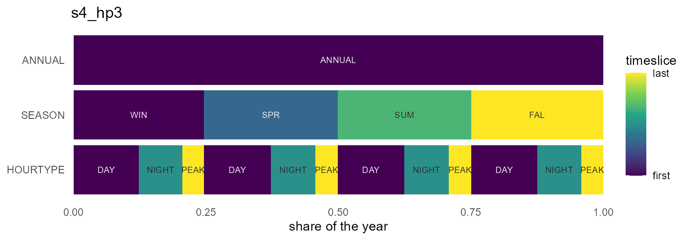
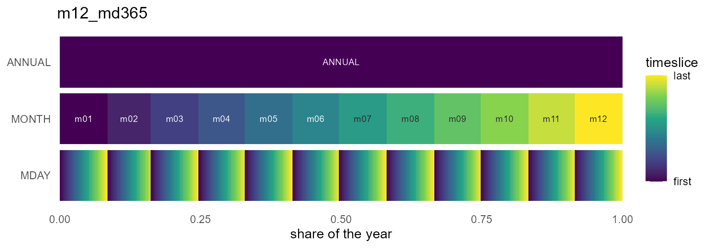

# Calendar catalog

## The catalog

`timescales` ships a curated catalog of named calendar designs, ported
from the predecessor `timeslices` package. Every id can be built fresh
with `calendar(id)`, and the same objects come pre-built in the
`calendars` dataset:

``` r

knitr::kable(calendar_catalog())
```

| id | tokens | timeframes | n_timeslices | coverage | regularity | desc |
|:---|:---|:---|---:|:---|:---|:---|
| d360 | d360 | YDAY | 360 | truncated | regular | YDAY calendar (360 timeslices; truncated, regular) |
| d364 | d364 | YDAY | 364 | truncated | regular | YDAY calendar (364 timeslices; truncated, regular) |
| d365 | d365 | YDAY | 365 | truncated | regular | YDAY calendar (365 timeslices; truncated, regular) |
| d366 | d366 | YDAY | 366 | complete | regular | YDAY calendar (366 timeslices; complete, regular) |
| d360_h24 | d360+h24 | YDAY/HOUR | 8640 | truncated | regular | YDAY/HOUR calendar (8640 timeslices; truncated, regular) |
| d364_h24 | d364+h24 | YDAY/HOUR | 8736 | truncated | regular | YDAY/HOUR calendar (8736 timeslices; truncated, regular) |
| d365_h24 | d365+h24 | YDAY/HOUR | 8760 | truncated | regular | YDAY/HOUR calendar (8760 timeslices; truncated, regular) |
| d366_h24 | d366+h24 | YDAY/HOUR | 8784 | complete | regular | YDAY/HOUR calendar (8784 timeslices; complete, regular) |
| m12 | m12 | MONTH | 12 | complete | regular | MONTH calendar (12 timeslices; complete, regular) |
| m12a | m12a | MONTH | 12 | complete | regular | MONTH calendar (12 timeslices; complete, regular) |
| m12_h24 | m12+h24 | MONTH/HOUR | 288 | complete | regular | MONTH/HOUR calendar (288 timeslices; complete, regular) |
| m12a_h24 | m12a+h24 | MONTH/HOUR | 288 | complete | regular | MONTH/HOUR calendar (288 timeslices; complete, regular) |
| m12_md360 | m12+md360 | MONTH/MDAY | 360 | truncated | regular | MONTH/MDAY calendar (360 timeslices; truncated, regular) |
| m12_md360_h24 | m12+md360+h24 | MONTH/MDAY/HOUR | 8640 | truncated | regular | MONTH/MDAY/HOUR calendar (8640 timeslices; truncated, regular) |
| m12_md365 | m12+md365 | MONTH/MDAY | 365 | truncated | irregular | MONTH/MDAY calendar (365 timeslices; truncated, irregular) |
| m12_md365_h24 | m12+md365+h24 | MONTH/MDAY/HOUR | 8760 | truncated | irregular | MONTH/MDAY/HOUR calendar (8760 timeslices; truncated, irregular) |
| m12_md366 | m12+md366 | MONTH/MDAY | 366 | complete | irregular | MONTH/MDAY calendar (366 timeslices; complete, irregular) |
| m12_md366_h24 | m12+md366+h24 | MONTH/MDAY/HOUR | 8784 | complete | irregular | MONTH/MDAY/HOUR calendar (8784 timeslices; complete, irregular) |
| q4 | q4 | QUARTER | 4 | complete | regular | QUARTER calendar (4 timeslices; complete, regular) |
| s4 | s4 | SEASON | 4 | complete | regular | SEASON calendar (4 timeslices; complete, regular) |
| q4_h24 | q4+h24 | QUARTER/HOUR | 96 | representative | regular | QUARTER/HOUR calendar (96 timeslices; representative, regular) |
| s4_h24 | s4+h24 | SEASON/HOUR | 96 | representative | regular | SEASON/HOUR calendar (96 timeslices; representative, regular) |
| w52 | w52 | WEEK | 52 | truncated | regular | WEEK calendar (52 timeslices; truncated, regular) |
| w53 | w53 | WEEK | 53 | complete | regular | WEEK calendar (53 timeslices; complete, regular) |
| w52_h24 | w52+h24 | WEEK/HOUR | 1248 | representative | regular | WEEK/HOUR calendar (1248 timeslices; representative, regular) |
| w53_h24 | w53+h24 | WEEK/HOUR | 1272 | representative | regular | WEEK/HOUR calendar (1272 timeslices; representative, regular) |
| w52_h168 | w52+h168 | WEEK/WHOUR | 8736 | truncated | regular | WEEK/WHOUR calendar (8736 timeslices; truncated, regular) |
| w53_h168 | w53+h168 | WEEK/WHOUR | 8904 | complete | irregular | WEEK/WHOUR calendar (8904 timeslices; complete, irregular) |
| wd7 | wd7 | WDAY | 7 | representative | regular | WDAY calendar (7 timeslices; representative, regular) |
| wd7_h24 | wd7+h24 | WDAY/HOUR | 168 | representative | regular | WDAY/HOUR calendar (168 timeslices; representative, regular) |
| wk2 | wk2 | DAYTYPE | 2 | representative | regular | DAYTYPE calendar (2 timeslices; representative, regular) |
| wk2_h24 | wk2+h24 | DAYTYPE/HOUR | 48 | representative | regular | DAYTYPE/HOUR calendar (48 timeslices; representative, regular) |
| hp3 | hp3 | HOURTYPE | 3 | representative | regular | HOURTYPE calendar (3 timeslices; representative, regular) |
| d365_hp3 | d365+hp3 | YDAY/HOURTYPE | 1095 | representative | regular | YDAY/HOURTYPE calendar (1095 timeslices; representative, regular) |
| m12a_hp3 | m12a+hp3 | MONTH/HOURTYPE | 36 | representative | regular | MONTH/HOURTYPE calendar (36 timeslices; representative, regular) |
| s4_hp3 | s4+hp3 | SEASON/HOURTYPE | 12 | representative | regular | SEASON/HOURTYPE calendar (12 timeslices; representative, regular) |
| q4_hp3 | q4+hp3 | QUARTER/HOURTYPE | 12 | representative | regular | QUARTER/HOURTYPE calendar (12 timeslices; representative, regular) |

Two equivalent ways to get one:

``` r

cal <- calendar("m12_h24")     # build on demand
cal2 <- calendars$m12_h24      # pre-built package data
identical(cal@leaves, cal2@leaves)
#> [1] TRUE
```

**Coverage** says how the design relates to a real year: `complete`
(every instant has a timeslice), `truncated` (a stylised year that drops
instants — `d365` has no Feb 29), or `representative` (timeslices stand
for recurring types rather than a partition of the timeline — `q4_h24`
is a representative day per quarter). **Regularity** flags designs whose
timeslices differ in length within a level (`m12_md365`: February is
short).

## Shares are duration-proportional

Unlike the timeslices originals — which gave every timeslice a uniform
share — catalog calendars weight timeslices by real duration:

``` r

m12 <- calendars$m12
data.frame(timeslice = m12@leaves$timeslice, share = round(m12@leaves$share, 4))[1:3, ]
#>   timeslice  share
#> 1       m01 0.0849
#> 2       m02 0.0767
#> 3       m03 0.0849
```

January is `31/365` of the year, not `1/12`. This is what makes
`recast_calendar(rule = "sum")` conserve and `weighted_mean` weight
correctly.

## The workhorses

The designs most models start from:

``` r

calendars$d365_h24    # 8,760 hourly timeslices, the full-resolution classic
#> Calendar: d365_h24 
#> Timeframes (2):
#>   - YDAY (365) [token: d365, alignment: drop_feb29]
#>   - HOUR (24) [token: h24]
#> Leaf timeslices: 8760
#> year_fraction: 1
#> year_start: month=1, day=1
#> utc_offset_minutes: 0
calendars$m12_h24     # 288 timeslices: representative day per month
#> Calendar: m12_h24 
#> Timeframes (2):
#>   - MONTH (12) [token: m12]
#>   - HOUR (24) [token: h24]
#> Leaf timeslices: 288
#> year_fraction: 1
#> year_start: month=1, day=1
#> utc_offset_minutes: 0
calendars$q4_h24      # 96 timeslices: representative day per quarter
#> Calendar: q4_h24 
#> Timeframes (2):
#>   - QUARTER (4) [token: q4]
#>   - HOUR (24) [token: h24]
#> Leaf timeslices: 96
#> year_fraction: 1
#> year_start: month=1, day=1
#> utc_offset_minutes: 0
```

The `m12_md*` family carries a real month/day structure (non-Cartesian —
February is short), useful when data arrives keyed by month and
day-of-month:

``` r

md <- calendars$m12_md365
nrow(md@leaves)
#> [1] 365
head(md@leaves[md@leaves$MONTH == "m02", ], 2)
#>    MONTH MDAY       share timeslice weight
#> 32   m02  d01 0.002739726   m02_d01     24
#> 33   m02  d02 0.002739726   m02_d02     24
tail(md@leaves[md@leaves$MONTH == "m02", ], 1)   # Feb ends at d28
#>    MONTH MDAY       share timeslice weight
#> 59   m02  d28 0.002739726   m02_d28     24
instant_to_timeslice(as.Date(c("2021-03-15", "2020-02-29")), md)  # Feb 29 -> NA
#> [1] "m03_d15" NA
```

## Type axes: SEASON, DAYTYPE, HOURTYPE

Three derived timeframes back the compact “typical periods” designs —
and unlike in timeslices, they are fully datetime-convertible:

- `SEASON` — meteorological: `WIN` = Dec–Feb, `SPR`, `SUM`, `FAL`
- `DAYTYPE` — `WORKDAY` (Mon–Fri) / `WEEKEND`
- `HOURTYPE` — `NIGHT` (h22–h05), `PEAK` (h17–h20), `DAY` (the rest)

``` r

dtm <- as.POSIXct(c("2021-01-15 03:00", "2021-01-16 18:00",
                    "2021-07-14 12:00"), tz = "UTC")
instant_to_timeslice(dtm, calendars$s4_hp3)
#> [1] "WIN_NIGHT" "WIN_PEAK"  "SUM_DAY"
instant_to_timeslice(dtm, calendars$wk2_h24)
#> [1] "WORKDAY_h03" "WEEKEND_h18" "WORKDAY_h12"
```

The mappings are defaults, not dogma — register your own token (e.g. a
different peak window) with
[`register_token()`](https://optimal2050.github.io/timescales/r/reference/register_token.md)
and build a custom calendar from it.

## Visualizing calendars

[`autoplot()`](https://ggplot2.tidyverse.org/reference/autoplot.html)
(or [`plot()`](https://rdrr.io/r/graphics/plot.default.html)) draws a
calendar’s structure as an icicle: one band per timeframe with the
`ANNUAL` root on top, rectangle widths equal to timeslice shares, x
spanning the year on `[0, 1]`. The gradient restarts inside each parent
(`color_pattern = "within"`), so nested structure is visible at a
glance:

``` r

library(ggplot2)
autoplot(calendars$m12_h24)
```


``` r

autoplot(calendars$s4_hp3)
```



``` r

autoplot(calendars$m12_md365)
```



Dense calendars stay fast — rows beyond `max_segments` are binned before
drawing:

``` r

autoplot(calendars$d365_h24)
```


The geometry itself is available without ggplot2 via
[`calendar_layout()`](https://optimal2050.github.io/timescales/r/reference/calendar_layout.md)
— a plain `data.frame` of rectangles, usable from any plotting system:

``` r

head(calendar_layout(calendars$q4_h24), 7)
#>   timeframe  label timeslice rank       xmin       xmax ymin ymax      share
#> 1    ANNUAL ANNUAL    ANNUAL    0 0.00000000 1.00000000    2  2.9 1.00000000
#> 2   QUARTER     Q1        Q1    1 0.00000000 0.24657534    1  1.9 0.24657534
#> 3   QUARTER     Q2        Q2    1 0.24657534 0.49589041    1  1.9 0.24931507
#> 4   QUARTER     Q3        Q3    1 0.49589041 0.74794521    1  1.9 0.25205479
#> 5   QUARTER     Q4        Q4    1 0.74794521 1.00000000    1  1.9 0.25205479
#> 6      HOUR    h00    Q1_h00    2 0.00000000 0.01027397    0  0.9 0.01027397
#> 7      HOUR    h01    Q1_h01    2 0.01027397 0.02054795    0  0.9 0.01027397
#>   weight order within
#> 1   8760     1      1
#> 2   2160     1      1
#> 3   2184    25      2
#> 4   2208    49      3
#> 5   2208    73      4
#> 6     90     1      1
#> 7     90     2      2
```

[`calendar_plot()`](https://optimal2050.github.io/timescales/r/reference/calendar_plot.md)
is the data-on-calendar heatmap: hand it a `data.frame` keyed by
timeslice (or nothing, to see the share structure). The layout follows
the hierarchy — finest timeframe on y, next on x, coarser levels as
facets:

``` r

x <- data.frame(timeslice = calendars$m12_h24@leaves$timeslice)
x$load <- 80 + 40 * sin(seq(0, 6 * pi, length.out = nrow(x)))
calendar_plot(calendars$m12_h24, x, palette = "C")
```


## Recasting across the catalog

Any two catalog calendars convert into each other; totals are conserved
under `rule = "sum"`:

``` r

x <- data.frame(timeslice = calendars$m12@leaves$timeslice,
                energy = c(310, 280, 300, 250, 220, 230,
                           260, 270, 240, 250, 280, 320))
recast_calendar(x, calendars$m12, calendars$s4, year = 2021, rule = "sum",
       by = "day")
#>   timeslice energy
#> 1       WIN    910
#> 2       SPR    770
#> 3       SUM    760
#> 4       FAL    770
sum(x$energy)
#> [1] 3210
```

Or aggregate within one calendar via the `ANNUAL` root:

``` r

recast_calendar(x, calendars$m12, to = "ANNUAL", year = 2021, rule = "sum",
       by = "day")
#>   timeslice energy
#> 1    ANNUAL   3210
```
