# Calendar catalog

## The catalog

`timescales` ships a curated catalog of named calendar designs, ported
from the predecessor `timeslices` package. Every id can be built fresh
with `calendar(id)`, and the same objects come pre-built in the
`calendars` dataset:

``` r

cal <- calendar("m12_h24")     # build on demand
cal2 <- calendars$m12_h24      # pre-built package data
identical(cal@leaftable, cal2@leaftable)
#> [1] TRUE
```

**Coverage** says how the design relates to a real year: `complete`
(every instant has a timeslice), `truncated` (a stylised year that drops
instants — `d365` has no Feb 29), or `representative` (timeslices stand
for recurring types rather than a partition of the timeline — `q4_h24`
is a representative day per quarter). **Regularity** flags designs whose
timeslices differ in length within a level (`m12_md365`: February is
short).

The full table is one
[`calendar_catalog()`](https://optimal2050.github.io/timescales/r/reference/calendar_catalog.md)
call; below it comes in families, each with one member drawn as an
icicle
([`autoplot()`](https://ggplot2.tidyverse.org/reference/autoplot.html);
widths are the timeslice shares, the `ANNUAL` root on top).

### Days of the year

Plain day counters, optionally with hours: the full-resolution
workhorses (`d365_h24` is the classic 8,760) and the stylised
360/364-day years some models use.

``` r

fam("^d3[0-9]{2}(_h24)?$")
```

| id       | timeframes | n_timeslices | coverage  | regularity |
|:---------|:-----------|-------------:|:----------|:-----------|
| d360     | YDAY       |          360 | truncated | regular    |
| d364     | YDAY       |          364 | truncated | regular    |
| d365     | YDAY       |          365 | truncated | regular    |
| d366     | YDAY       |          366 | complete  | regular    |
| d360_h24 | YDAY/HOUR  |         8640 | truncated | regular    |
| d364_h24 | YDAY/HOUR  |         8736 | truncated | regular    |
| d365_h24 | YDAY/HOUR  |         8760 | truncated | regular    |
| d366_h24 | YDAY/HOUR  |         8784 | complete  | regular    |

``` r

ggplot2::autoplot(calendars$d365_h24)
```

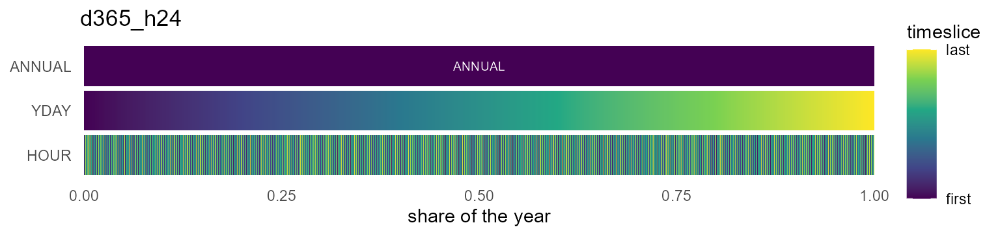

### Months

Twelve calendar months (`m01..m12`, or `JAN..DEC` as `m12a`), optionally
with a representative day of 24 hours.

``` r

fam("^m12(a|_h24|a_h24)?$")
```

| id       | timeframes | n_timeslices | coverage | regularity |
|:---------|:-----------|-------------:|:---------|:-----------|
| m12      | MONTH      |           12 | complete | regular    |
| m12a     | MONTH      |           12 | complete | regular    |
| m12_h24  | MONTH/HOUR |          288 | complete | regular    |
| m12a_h24 | MONTH/HOUR |          288 | complete | regular    |

``` r

ggplot2::autoplot(calendars$m12_h24)
```

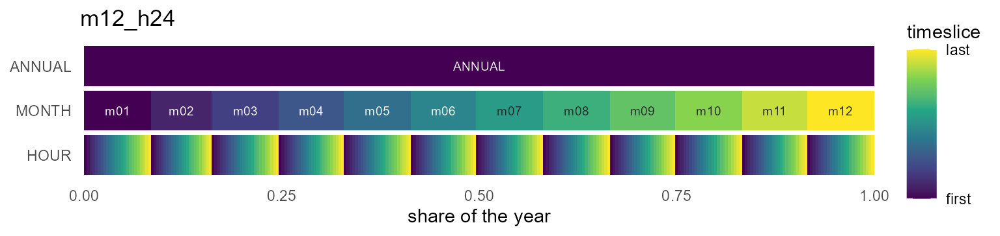

### Month x day-of-month

A real month/day structure — non-Cartesian, February is short — for data
keyed by month and day-of-month.

``` r

fam("^m12_md")
```

| id            | timeframes      | n_timeslices | coverage  | regularity |
|:--------------|:----------------|-------------:|:----------|:-----------|
| m12_md360     | MONTH/MDAY      |          360 | truncated | regular    |
| m12_md360_h24 | MONTH/MDAY/HOUR |         8640 | truncated | regular    |
| m12_md365     | MONTH/MDAY      |          365 | truncated | irregular  |
| m12_md365_h24 | MONTH/MDAY/HOUR |         8760 | truncated | irregular  |
| m12_md366     | MONTH/MDAY      |          366 | complete  | irregular  |
| m12_md366_h24 | MONTH/MDAY/HOUR |         8784 | complete  | irregular  |

``` r

ggplot2::autoplot(calendars$m12_md365)
```


### Quarters and seasons

Four calendar quarters, or the meteorological seasons (`WIN` = Dec-Feb —
a season straddles the year boundary, which is why it is its own axis).

``` r

fam("^(q4|s4)(_h24)?$")
```

| id     | timeframes   | n_timeslices | coverage       | regularity |
|:-------|:-------------|-------------:|:---------------|:-----------|
| q4     | QUARTER      |            4 | complete       | regular    |
| s4     | SEASON       |            4 | complete       | regular    |
| q4_h24 | QUARTER/HOUR |           96 | representative | regular    |
| s4_h24 | SEASON/HOUR  |           96 | representative | regular    |

``` r

ggplot2::autoplot(calendars$s4_h24)
```

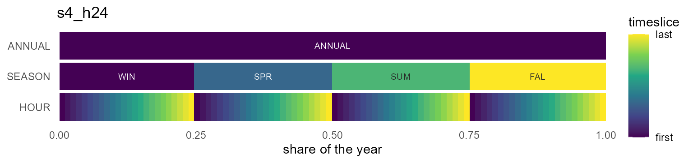

### Weeks

52 or 53 weeks, with a representative day (`_h24`) or the full 168-hour
week (`_h168`).

``` r

fam("^w5")
```

| id       | timeframes | n_timeslices | coverage       | regularity |
|:---------|:-----------|-------------:|:---------------|:-----------|
| w52      | WEEK       |           52 | truncated      | regular    |
| w53      | WEEK       |           53 | complete       | regular    |
| w52_h24  | WEEK/HOUR  |         1248 | representative | regular    |
| w53_h24  | WEEK/HOUR  |         1272 | representative | regular    |
| w52_h168 | WEEK/WHOUR |         8736 | truncated      | regular    |
| w53_h168 | WEEK/WHOUR |         8904 | complete       | irregular  |

``` r

ggplot2::autoplot(calendars$w52_h24)
```

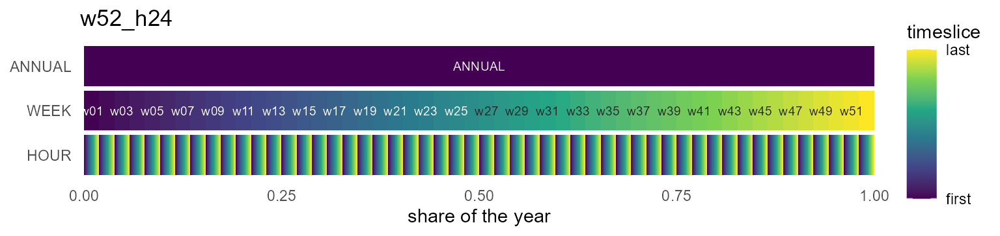

### Weekdays and day types

The seven weekdays, or the compact workday/weekend pair — the smallest
designs that still resolve a weekly demand cycle.

``` r

fam("^(wd7|wk2)")
```

| id      | timeframes   | n_timeslices | coverage       | regularity |
|:--------|:-------------|-------------:|:---------------|:-----------|
| wd7     | WDAY         |            7 | representative | regular    |
| wd7_h24 | WDAY/HOUR    |          168 | representative | regular    |
| wk2     | DAYTYPE      |            2 | representative | regular    |
| wk2_h24 | DAYTYPE/HOUR |           48 | representative | regular    |

``` r

ggplot2::autoplot(calendars$wk2_h24)
```

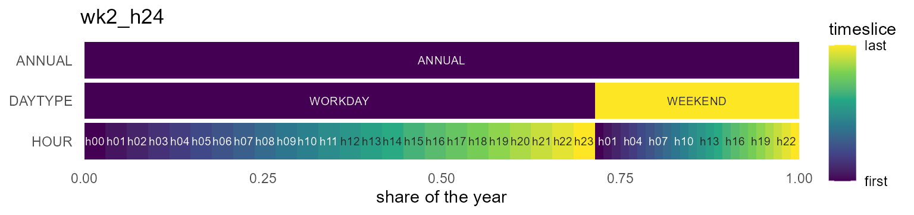

### Hour types

`DAY`/`NIGHT`/`PEAK` hour classes on their own or under a coarser axis —
the “typical periods” family.

``` r

fam("hp3$")
```

| id       | timeframes       | n_timeslices | coverage       | regularity |
|:---------|:-----------------|-------------:|:---------------|:-----------|
| hp3      | HOURTYPE         |            3 | representative | regular    |
| d365_hp3 | YDAY/HOURTYPE    |         1095 | representative | regular    |
| m12a_hp3 | MONTH/HOURTYPE   |           36 | representative | regular    |
| s4_hp3   | SEASON/HOURTYPE  |           12 | representative | regular    |
| q4_hp3   | QUARTER/HOURTYPE |           12 | representative | regular    |

``` r

ggplot2::autoplot(calendars$s4_hp3)
```

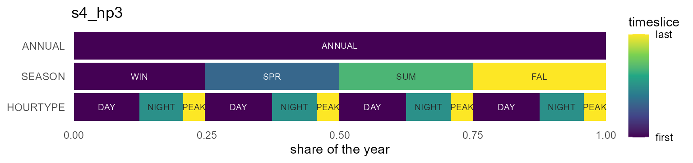

### Fiscal years (April-start)

The same designs anchored to April 1 — Indian fiscal reporting; note the
member order starting at `m04`/`Q2` (details in the [Fiscal
years](#fiscal-years-the-fy04_-family) section below).

``` r

fam("^fy04")
```

| id            | timeframes   | n_timeslices | coverage       | regularity |
|:--------------|:-------------|-------------:|:---------------|:-----------|
| fy04_m12      | MONTH        |           12 | complete       | regular    |
| fy04_m12_h24  | MONTH/HOUR   |          288 | complete       | regular    |
| fy04_q4       | QUARTER      |            4 | complete       | regular    |
| fy04_q4_h24   | QUARTER/HOUR |           96 | representative | regular    |
| fy04_d365     | YDAY         |          365 | truncated      | regular    |
| fy04_d365_h24 | YDAY/HOUR    |         8760 | truncated      | regular    |

``` r

ggplot2::autoplot(calendars$fy04_m12)
```

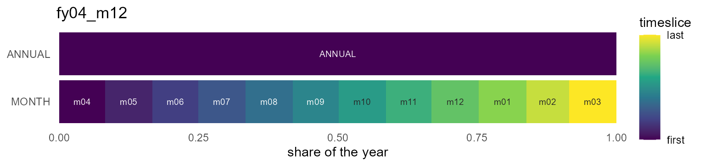

## Shares are duration-proportional

Unlike the timeslices originals — which gave every timeslice a uniform
share — catalog calendars weight timeslices by real duration:

``` r

m12 <- calendars$m12
data.frame(timeslice = m12@leaftable$timeslice, share = round(m12@leaftable$share, 4))[1:3, ]
#>   timeslice  share
#> 1       m01 0.0849
#> 2       m02 0.0767
#> 3       m03 0.0849
```

January is `31/365` of the year, not `1/12`. This is what makes
`recast_calendar(rule = "sum")` conserve and `weighted_mean` weight
correctly.

## The workhorses

The designs most models start from:

``` r

calendars$d365_h24    # 8,760 hourly timeslices, the full-resolution classic
#> Calendar: d365_h24 
#> Timeframes (2):
#>   - YDAY (365) [token: d365, alignment: drop_feb29]
#>   - HOUR (24) [token: h24]
#> Leaf timeslices: 8760
#> year_fraction: 1
#> year_start: month=1, day=1
#> utc_offset_minutes: 0
calendars$m12_h24     # 288 timeslices: representative day per month
#> Calendar: m12_h24 
#> Timeframes (2):
#>   - MONTH (12) [token: m12]
#>   - HOUR (24) [token: h24]
#> Leaf timeslices: 288
#> year_fraction: 1
#> year_start: month=1, day=1
#> utc_offset_minutes: 0
calendars$q4_h24      # 96 timeslices: representative day per quarter
#> Calendar: q4_h24 
#> Timeframes (2):
#>   - QUARTER (4) [token: q4]
#>   - HOUR (24) [token: h24]
#> Leaf timeslices: 96
#> year_fraction: 1
#> year_start: month=1, day=1
#> utc_offset_minutes: 0
```

The `m12_md*` family carries a real month/day structure (non-Cartesian —
February is short), useful when data arrives keyed by month and
day-of-month:

``` r

md <- calendars$m12_md365
nrow(md@leaftable)
#> [1] 365
head(md@leaftable[md@leaftable$MONTH == "m02", ], 2)
#>    MONTH MDAY       share timeslice weight
#> 32   m02  d01 0.002739726   m02_d01     24
#> 33   m02  d02 0.002739726   m02_d02     24
tail(md@leaftable[md@leaftable$MONTH == "m02", ], 1)   # Feb ends at d28
#>    MONTH MDAY       share timeslice weight
#> 59   m02  d28 0.002739726   m02_d28     24
datetime_to_timeslice(as.Date(c("2021-03-15", "2020-02-29")), md)  # Feb 29 -> NA
#> [1] "m03_d15" NA
```

## Type axes: SEASON, DAYTYPE, HOURTYPE

Three derived timeframes back the compact “typical periods” designs —
and unlike in timeslices, they are fully datetime-convertible:

- `SEASON` — meteorological: `WIN` = Dec–Feb, `SPR`, `SUM`, `FAL`
- `DAYTYPE` — `WORKDAY` (Mon–Fri) / `WEEKEND`
- `HOURTYPE` — `NIGHT` (h22–h05), `PEAK` (h17–h20), `DAY` (the rest)

``` r

dtm <- as.POSIXct(c("2021-01-15 03:00", "2021-01-16 18:00",
                    "2021-07-14 12:00"), tz = "UTC")
datetime_to_timeslice(dtm, calendars$s4_hp3)
#> [1] "WIN_NIGHT" "WIN_PEAK"  "SUM_DAY"
datetime_to_timeslice(dtm, calendars$wk2_h24)
#> [1] "WORKDAY_h03" "WEEKEND_h18" "WORKDAY_h12"
```

The mappings are defaults, not dogma — register your own token (e.g. a
different peak window) with
[`register_token()`](https://optimal2050.github.io/timescales/r/reference/register_token.md)
and build a custom calendar from it.

## Fiscal years: the `fy04_*` family

Many reporting systems run April..March — Indian national statistics
most prominently. The `fy04_*` entries (`fy04_m12`, `fy04_m12_h24`,
`fy04_q4`, `fy04_q4_h24`, `fy04_d365`, `fy04_d365_h24`) anchor the model
year to April 1: model year `y` spans `[y-04-01, y+1-04-01)`, and the
anchored `YEAR` is the *starting* Gregorian year (Indian “FY 2021-22” is
model year 2021).

``` r

fy <- calendar("fy04_m12")
fy@members$MONTH                       # April first
#>  [1] "m04" "m05" "m06" "m07" "m08" "m09" "m10" "m11" "m12" "m01" "m02" "m03"
g <- expand_calendar(fy, 2021, by = "day")
range(as.Date(g$datetime))             # 2021-04-01 .. 2022-03-31
#> [1] "2021-04-01" "2022-03-31"
datetime_to_timeslice(as.Date("2022-01-15"), fy)   # January stays m01
#> [1] "m01"
```

Two rules keep fiscal calendars unambiguous:

- **Labels stay Gregorian.** April is `m04` and Apr–Jun is `Q2`, always;
  only the member *order* starts at the anchor (`m04..m03`,
  `Q2,Q3,Q4,Q1`). Fiscal-renumbered labels would silently collide with
  the Gregorian label matcher.
- **The catalog is UTC.** Data already in Indian local time maps as-is;
  to map true-UTC instants at Indian midnight boundaries, pass the IST
  offset: `calendar("fy04_m12", utc_offset_minutes = 330L)`. (Constant
  offsets only for now — Olson time zones / DST are a planned later
  phase.)

Leap years take care of themselves: `fy04_d365` drops the Feb 29 that
falls in the *following* Gregorian year (FY2023 contains 2024-02-29) and
keeps March aligned to `d365`. Any other anchor works by argument on any
design: `calendar("m12", year_start = list(month = 7L, day = 1L))`.

## Visualizing calendars

(For the full plot-type tour on real data – heatmap layers, wall
calendars, profiles, ribbons, duration curves – see
[Visualization](https://optimal2050.github.io/timescales/r/articles/visualization.md).)

[`autoplot()`](https://ggplot2.tidyverse.org/reference/autoplot.html)
(or [`plot()`](https://rdrr.io/r/graphics/plot.default.html)) draws a
calendar’s structure as an icicle: one band per timeframe with the
`ANNUAL` root on top, rectangle widths equal to timeslice shares, x
spanning the year on `[0, 1]`. The gradient restarts inside each parent
(`color_pattern = "within"`), so nested structure is visible at a glance
— the catalog tour above shows one per family. Dense calendars stay
fast: rows beyond `max_segments` are binned before drawing:

``` r

library(ggplot2)
autoplot(calendars$d365_h24, max_segments = 1000)
```

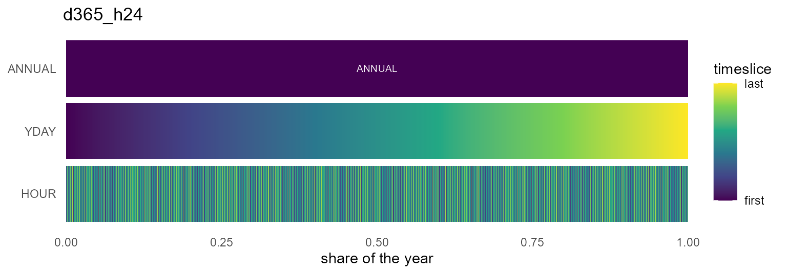

The same figure carries data: pass `data =`/`z =` and every band fills
with the value recast to that band’s resolution — here a year of
Reykjavik wind, from the annual mean down to the month × hour grid:

``` r

wind <- merra2_cities |>
  filter(city == "Reykjavik") |>
  mutate(timeslice = datetime_to_timeslice(datetime, calendars$m12_h24)) |>
  summarise(W50M = mean(W50M), .by = timeslice)

autoplot(calendars$m12_h24, data = wind, z = "W50M",
         rule = "weighted_mean", year = 2019) +
  labs(fill = "m/s")
```

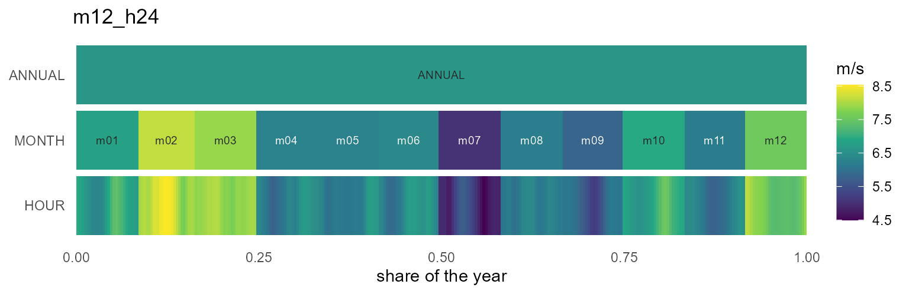

The geometry itself is available without ggplot2 via
[`calendar_layout()`](https://optimal2050.github.io/timescales/r/reference/calendar_layout.md)
— a plain `data.frame` of rectangles, usable from any plotting system:

``` r

head(calendar_layout(calendars$q4_h24), 7)
#>   timeframe  label timeslice rank       xmin       xmax ymin ymax      share
#> 1    ANNUAL ANNUAL    ANNUAL    0 0.00000000 1.00000000    2  2.9 1.00000000
#> 2   QUARTER     Q1        Q1    1 0.00000000 0.24657534    1  1.9 0.24657534
#> 3   QUARTER     Q2        Q2    1 0.24657534 0.49589041    1  1.9 0.24931507
#> 4   QUARTER     Q3        Q3    1 0.49589041 0.74794521    1  1.9 0.25205479
#> 5   QUARTER     Q4        Q4    1 0.74794521 1.00000000    1  1.9 0.25205479
#> 6      HOUR    h00    Q1_h00    2 0.00000000 0.01027397    0  0.9 0.01027397
#> 7      HOUR    h01    Q1_h01    2 0.01027397 0.02054795    0  0.9 0.01027397
#>   weight order within
#> 1   8760     1      1
#> 2   2160     1      1
#> 3   2184    25      2
#> 4   2208    49      3
#> 5   2208    73      4
#> 6     90     1      1
#> 7     90     2      2
```

[`calendar_plot()`](https://optimal2050.github.io/timescales/r/reference/calendar_plot.md)
is the data-on-calendar heatmap: hand it a `data.frame` keyed by
timeslice (or nothing, to see the share structure). The layout follows
the hierarchy — finest timeframe on y, next on x, coarser levels as
facets:

``` r

x <- data.frame(timeslice = calendars$m12_h24@leaftable$timeslice)
x$load <- 80 + 40 * sin(seq(0, 6 * pi, length.out = nrow(x)))
calendar_plot(calendars$m12_h24, x, palette = "C")
```

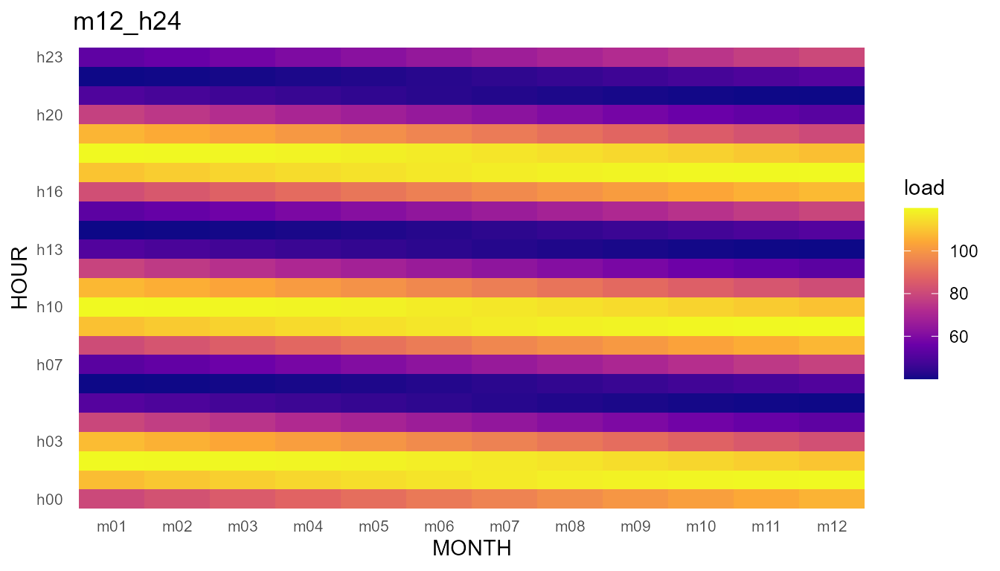

## Wall calendars

[`calendar_wall_plot()`](https://optimal2050.github.io/timescales/r/reference/calendar_wall_plot.md)
draws the familiar wall form: one facet per month, day cells in a week
grid. The weekday arrangement is year-specific (which weekday a date
falls on comes from the base grid), so pass `year=`; without it the
layout falls back to a year-free 7-wide sequence with a message.

``` r

calendar_wall_plot(calendar("m12_md365"), year = 2021)
```

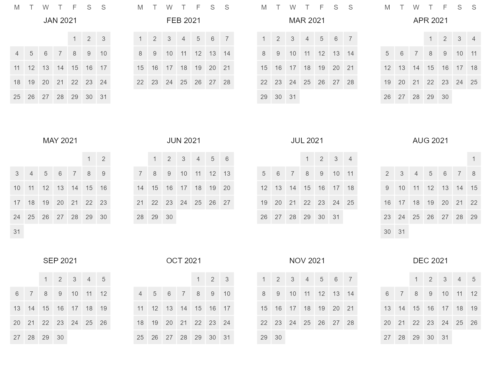

Daily (or finer – aggregated by `fun`) data fills the cells, and the
fiscal calendars facet April-first out of the box:

``` r

cal <- calendar("fy04_d365")
x <- data.frame(timeslice = cal@leaftable$timeslice,
                v = cumsum(rnorm(365)))
calendar_wall_plot(cal, x, z = "v", year = 2021)
```

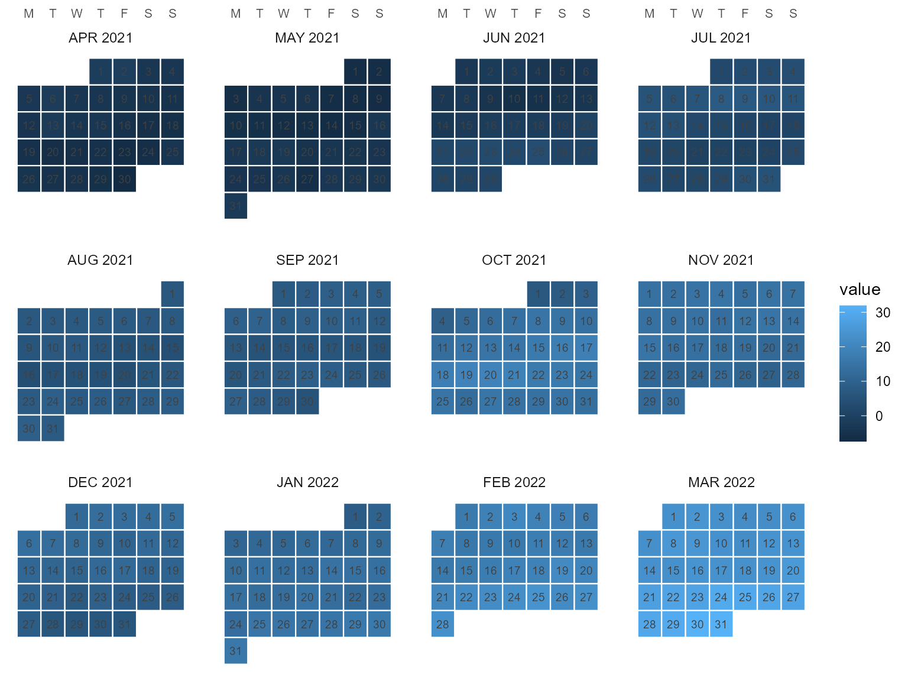

The pieces are reusable on their own:
`calendar_weekdays(cal, year, week_start = "MON")` tabulates the day
layer’s dates, weekdays, week-of-month rows and an anchored week-of-year
(fiscal weeks from April 1 for `fy04_*`; `week_start` accepts any of
`MON..SUN`), and
[`calendar_wall_layout()`](https://optimal2050.github.io/timescales/r/reference/calendar_wall_layout.md)
returns the plain tile frame the figure is built from.

## Recasting across the catalog

Any two catalog calendars convert into each other; totals are conserved
under `rule = "sum"`:

``` r

x <- data.frame(timeslice = calendars$m12@leaftable$timeslice,
                energy = c(310, 280, 300, 250, 220, 230,
                           260, 270, 240, 250, 280, 320))
recast_calendar(x, calendars$m12, calendars$s4, year = 2021, rule = "sum",
       by = "day")
#>   timeslice energy
#> 1       WIN    910
#> 2       SPR    770
#> 3       SUM    760
#> 4       FAL    770
sum(x$energy)
#> [1] 3210
```

Or aggregate within one calendar via the `ANNUAL` root:

``` r

recast_calendar(x, calendars$m12, to = "ANNUAL", year = 2021, rule = "sum",
       by = "day")
#>   timeslice energy
#> 1    ANNUAL   3210
```
