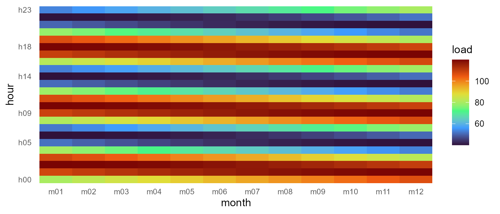

# Getting started with timescales

## What problem does this solve?

Energy-system, climate, and operations models all carve the year into
discrete *timeslices*. Different models pick different slicings: 365
days, 12 months, 4 quarters × 24 hours, 168 hours of a representative
week, and so on. The timeslice **labels** are arbitrary, the **shares of
a year** are model-defined, and converting data between slicings is
error-prone.

`timescales` represents any such slicing as a **Calendar**: an ordered
hierarchy of *timeframes* (`YEAR`, `MONTH`, `HOUR`, …) whose finest
nodes — enumerated in the `@leaftable` — are the timeslices. With one
object you get:

- a stable schema for the timeslice labels and their year-share weights,
- well-defined mappings to and from real datetimes,
- well-defined conversions between any two calendars covering the same
  year fraction,
- ggplot2-ready visualization, from heatmap layers to wall calendars.

## A 5-minute tour

### 1. Build a calendar

The fastest path uses **token-based names** — 43 curated designs ship in
the catalog
([`calendar_catalog()`](https://optimal2050.github.io/timescales/r/reference/calendar_catalog.md)),
from `d365_h24` down to typical-period compressions, including the
April-anchored fiscal family (`calendar("fy04_m12")` — Indian reporting
years):

``` r

cal_my <- calendar("m12_h24")    # 12 months × 24 hours = 288 timeslices
cal_my
#> Calendar: m12_h24 
#> Timeframes (2):
#>   - MONTH (12) [token: m12]
#>   - HOUR (24) [token: h24]
#> Leaf timeslices: 288
#> year_fraction: 1
#> year_start: month=1, day=1
#> utc_offset_minutes: 0
```

Equivalent declarative form:

``` r

cal_my2 <- calendar_build("m12", "h24")
identical(cal_my@timeframes, cal_my2@timeframes)
#> [1] TRUE
```

For full control there is the lowest-level constructor
[`calendar_from_leaftable()`](https://optimal2050.github.io/timescales/r/reference/calendar_from_leaftable.md),
where you supply the leaves table directly.

### 2. Inspect the structure

A `Calendar` has four parts:

``` r

cal_my@timeframes               # the timeframe hierarchy, coarsest first
#> [1] "MONTH" "HOUR"
head(calendar_leaftable(cal_my), 4)          # the leaf table (one row per timeslice)
#>   MONTH HOUR       share weight timeslice
#> 1   m01  h00 0.003538813     31   m01_h00
#> 2   m02  h00 0.003196347     28   m02_h00
#> 3   m03  h00 0.003538813     31   m03_h00
#> 4   m04  h00 0.003424658     30   m04_h00
cal_my@members$MONTH             # ordered label vocabulary per timeframe
#>  [1] "m01" "m02" "m03" "m04" "m05" "m06" "m07" "m08" "m09" "m10" "m11" "m12"
cal_my@meta[c("name", "year_fraction")]
#> $name
#> [1] "m12_h24"
#> 
#> $year_fraction
#> [1] 1
```

`@leaftable` is a plain `data.frame`. Each row is one timeslice, with
columns:

- `timeslice` — the unique timeslice ID,
- `share` — fraction of a year,
- `weight` — timeslice weight in hours (default `share * 8760`),
- one column per timeframe — the member label at that level.

### 3. Map real datetimes onto the calendar

``` r

times <- as.POSIXct(c("2025-01-15 03:00", "2025-07-20 18:00"), tz = "UTC")
datetime_to_timeslice(times, cal_my)
#> [1] "m01_h03" "m07_h18"
```

### 4. Convert data between calendars

Suppose you have monthly load values and need quarterly averages:

``` r

cal_m <- calendar("m12")
cal_q <- calendar("q4")

monthly <- data.frame(
  timeslice = sprintf("m%02d", 1:12),
  load  = c(120, 118, 105,  92,  85,  88,  95, 100,  98,  90, 105, 122)
)

recast_calendar(monthly, from = cal_m, to = cal_q, year = 2025,
       rule = "weighted_mean", by = "day")
#>   timeslice      load
#> 1        Q1 114.21111
#> 2        Q2  88.29670
#> 3        Q3  97.66304
#> 4        Q4 105.67391
```

The result is day-weighted: Q1 = (31·v₁ + 28·v₂ + 31·v₃) / 90. The
`rule` is deliberately mandatory — pass one, or register it per column
with
[`register_calendar_rule()`](https://optimal2050.github.io/timescales/r/reference/register_calendar_rule.md);
a silently guessed rule would be a silent unit error.
[`join_calendar()`](https://optimal2050.github.io/timescales/r/reference/join_calendar.md)
is the lighter companion: it *attaches* a calendar’s labels and
timeframe columns to a dataset instead of converting it.

### 5. Visualize

Every figure tier works through normal ggplot2 — a heatmap layer here;
wall calendars, profiles, duration curves, and the data-filled structure
figures (icicles and stacks take `data =`/`z =`) in
[`vignette("visualization")`](https://optimal2050.github.io/timescales/r/articles/visualization.md):

``` r

library(ggplot2)
x <- data.frame(timeslice = calendar_leaftable(cal_my)$timeslice)
x$load <- 80 + 40 * sin(seq(0, 6 * pi, length.out = nrow(x)))
ggplot(x) +
  geom_calendar_tile(calendar = cal_my, z = "load") +
  scale_fill_viridis_c(option = "H") +
  scale_y_discrete(breaks = calendar_breaks()) +
  labs(x = "month", y = "hour", fill = "load") +
  theme_calendar()
```



## Where to next?

- [Concepts](https://optimal2050.github.io/timescales/r/articles/concepts.md)
  — the core ideas behind calendars and timeframes.
- [Data
  structures](https://optimal2050.github.io/timescales/r/articles/data-structures.md)
  — anatomy of a `Calendar` object and its supporting registries.
- [Data
  manipulation](https://optimal2050.github.io/timescales/r/articles/data-manipulation.md)
  — the tidy workflow end to end: attach, recast, crosswalks, backends.
- [Calendars](https://optimal2050.github.io/timescales/r/articles/calendars.md)
  — the built-in catalog, fiscal years, and wall calendars.
- [Visualization](https://optimal2050.github.io/timescales/r/articles/visualization.md)
  — the ggplot2 integration contract and the full plot-type tour on real
  weather data.
