# Visualization with ggplot2

## The viz surface at a glance

| kind | functions | use when |
|----|----|----|
| composable layers | [`geom_calendar()`](https://optimal2050.github.io/timescales/r/reference/geom_calendar.md), [`geom_calendar_tile()`](https://optimal2050.github.io/timescales/r/reference/geom_calendar.md), [`theme_calendar()`](https://optimal2050.github.io/timescales/r/reference/geom_calendar.md), [`calendar_breaks()`](https://optimal2050.github.io/timescales/r/reference/calendar_breaks.md) | you are building your own [`ggplot()`](https://ggplot2.tidyverse.org/reference/ggplot.html) and want data-on-calendar tiles as one layer among others |
| assembled figures | [`calendar_autoplot()`](https://optimal2050.github.io/timescales/r/reference/calendar_autoplot.md) (structure icicle), [`calendar_plot()`](https://optimal2050.github.io/timescales/r/reference/calendar_plot.md) (heatmap), [`calendar_wall_plot()`](https://optimal2050.github.io/timescales/r/reference/calendar_wall_plot.md) (wall calendar) | you want a finished figure in one call |
| layout workers | [`calendar_layout()`](https://optimal2050.github.io/timescales/r/reference/calendar_layout.md), [`calendar_wall_layout()`](https://optimal2050.github.io/timescales/r/reference/calendar_wall_layout.md), [`calendar_weekdays()`](https://optimal2050.github.io/timescales/r/reference/calendar_weekdays.md) | you want the plain data frames behind the figures, to draw something the package did not anticipate |

This vignette walks through all three tiers on one running example — and
because every axis is an ordinary vocabulary-ordered factor, everything
composes with standard ggplot2 scales, facets, and themes.

## The sample

`merra2_cities` ships three contrasting hourly weather series for 2019 —
Helsinki (high latitude), Lima (equatorial), Sydney (southern
hemisphere) — extracted from NASA’s MERRA-2 reanalysis:

``` r

str(merra2_cities)
#> 'data.frame':    105120 obs. of  11 variables:
#>  $ city       : chr  "Beijing" "Beijing" "Beijing" "Beijing" ...
#>  $ locid      : int  150235 150235 150235 150235 150235 150235 150235 150235 150235 150235 ...
#>  $ datetime   : POSIXct, format: "2019-01-01 00:30:00" "2019-01-01 01:30:00" ...
#>  $ T10M       : num  -10 -9 -6 -3 -2 -1 0 0 -2 -3 ...
#>  $ W10M       : num  4.9 5.9 6.2 5.9 5.7 ...
#>  $ W50M       : num  6.8 7 7.1 6.9 6.8 ...
#>  $ WDIR       : num  140 150 160 160 160 160 160 170 160 150 ...
#>  $ SWGDN      : num  79 211 331 411 444 416 330 191 43 0 ...
#>  $ ALBEDO     : num  0.18 0.16 0.15 0.14 0.14 ...
#>  $ PRECTOTCORR: num  0 0 0 0 0 0 0 0 0 0 ...
#>  $ RHOA       : num  1.34 1.34 1.32 1.31 1.3 ...
```

Instants are stamped at 30 minutes past the hour (the MERRA-2
hourly-mean convention);
[`datetime_to_timeslice()`](https://optimal2050.github.io/timescales/r/reference/datetime_to_timeslice.md)
floors them into hourly timeslices, so no preprocessing is needed.

## The integration contract

The geoms are deliberately *thin*. Each one returns **a single standard
[`geom_tile()`](https://ggplot2.tidyverse.org/reference/geom_tile.html)
layer** whose data is derived from the plot (or layer) data; nothing is
a custom ggproto Geom or Stat. That has three visible consequences:

- **Calendar inputs are column names, not
  [`aes()`](https://ggplot2.tidyverse.org/reference/aes.html) mappings**
  — `datetime =`, `timeslice =`, `z =` name columns of the data. ggplot2
  trains positional scales *before* statistics run, so a Stat cannot
  emit the discrete axes a calendar heatmap needs; a layer factory that
  pre-aggregates can. (The predecessor package solved this with ~340
  lines of custom `scale_x/y_calendar` machinery — deliberately not
  ported.)
- **Axes are vocabulary-ordered factors**, so
  [`scale_x_discrete()`](https://ggplot2.tidyverse.org/reference/scale_discrete.html),
  [`facet_wrap()`](https://ggplot2.tidyverse.org/reference/facet_wrap.html),
  coordinate flips, and themes all work through the normal ggplot2 path.
  Dense vocabularies thin cleanly with
  [`calendar_breaks()`](https://optimal2050.github.io/timescales/r/reference/calendar_breaks.md),
  which always keeps the end values on the axis. Fiscal calendars order
  themselves: an `fy04_*` axis starts at `m04` because that is its
  member order.
- **Facet columns ride through `by =`** — aggregation happens within
  each combination of the listed columns, and those columns survive into
  the layer data, ready for
  [`facet_wrap()`](https://ggplot2.tidyverse.org/reference/facet_wrap.html).

## Heatmaps: data on a calendar

[`geom_calendar()`](https://optimal2050.github.io/timescales/r/reference/geom_calendar.md)
cuts a datetime column to timeslices and aggregates into tiles. Helsinki
wind on the full-resolution `d365_h24` calendar, with energypal’s Global
Wind Atlas ramp:

``` r

hel <- merra2_cities |> filter(city == "Helsinki")

ggplot(hel) +
  geom_calendar(calendar = calendars$d365_h24,
                datetime = "datetime", z = "W50M") +
  energypal::scale_fill_energy_c(palette = "windatlas") +
  scale_x_discrete(breaks = calendar_breaks(10)) +
  scale_y_discrete(breaks = calendar_breaks()) +
  labs(x = "day of year", y = "hour", fill = "m/s",
       title = "Helsinki wind speed at 50 m, 2019") +
  theme_calendar()
```

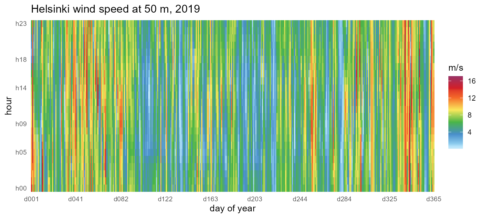

The representative-day view compresses the same year into `m12_h24`
(month x hour), and the `by=` argument carries the `city` column through
aggregation so facets work.
[`calendar_breaks()`](https://optimal2050.github.io/timescales/r/reference/calendar_breaks.md)
keeps the twelve-month and 24-hour axes legible inside narrow facets
while pinning the end values. Times are UTC, so each city’s solar noon
sits at its longitude’s offset (Lima ~16h, Sydney ~01h — a calendar with
`utc_offset_minutes` shifts this to local time):

``` r

ggplot(merra2_cities) +
  geom_calendar(calendar = calendars$m12_h24,
                datetime = "datetime", z = "SWGDN", by = "city") +
  facet_wrap(~city) +
  energypal::scale_fill_energy_c(palette = "solaratlas_ghi") +
  scale_x_discrete(breaks = calendar_breaks(4)) +
  scale_y_discrete(breaks = calendar_breaks()) +
  labs(x = "month", y = "hour", fill = "W/m2",
       title = "Mean solar irradiance by month and hour, 2019") +
  theme_calendar()
```

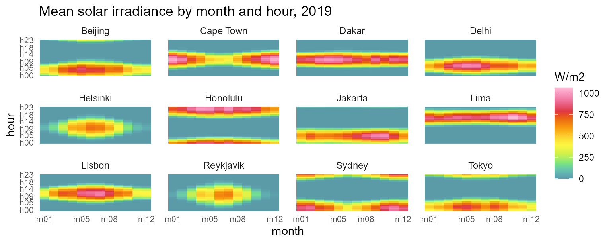

## Wall calendars

[`calendar_wall_plot()`](https://optimal2050.github.io/timescales/r/reference/calendar_wall_plot.md)
puts the same daily story in the familiar wall form: one facet per
month, day cells in a week grid, weekday initials across the top. The
hourly datetimes are detected automatically and collapse into day cells
with `fun`:

``` r

calendar_wall_plot(calendar("m12_md365"), hel, z = "T10M",
                   year = 2019) +
  scale_fill_viridis_c(option = "H") +
  labs(fill = "degC",
       title = "Helsinki daily mean temperature, 2019")
```

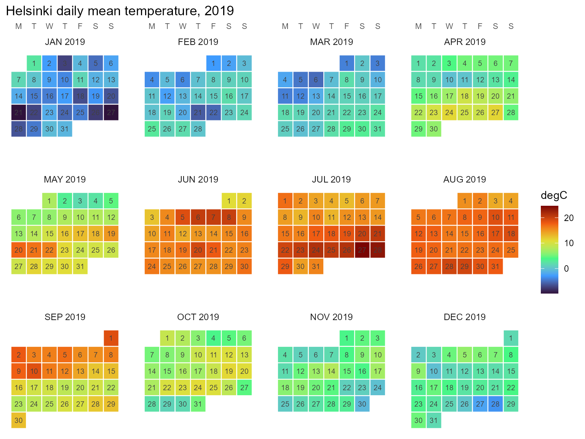

The weekday arrangement needs `year=` (which weekday a date falls on is
a fact about the year); `week_start` accepts any of `MON..SUN`. See
[`vignette("calendars")`](https://optimal2050.github.io/timescales/r/articles/calendars.md)
for the wall details and
[`calendar_weekdays()`](https://optimal2050.github.io/timescales/r/reference/calendar_weekdays.md)
for the underlying table.

## Timeslice-keyed data

Once data lives on timeslices,
[`geom_calendar_tile()`](https://optimal2050.github.io/timescales/r/reference/geom_calendar.md)
draws it directly, and
[`join_calendar()`](https://optimal2050.github.io/timescales/r/reference/join_calendar.md)
attaches timeframe columns for manual workflows:

``` r

cal <- calendars$m12_h24
hel_timeslices <- hel |>
  mutate(timeslice = datetime_to_timeslice(datetime, cal)) |>
  summarise(T10M = mean(T10M), .by = timeslice)

ggplot(hel_timeslices) +
  geom_calendar_tile(calendar = cal, z = "T10M") +
  scale_fill_viridis_c(option = "H") +
  scale_x_discrete(breaks = calendar_breaks()) +
  scale_y_discrete(breaks = calendar_breaks()) +
  labs(x = "month", y = "hour", fill = "degC",
       title = "Helsinki mean temperature (m12_h24)") +
  theme_calendar()
```

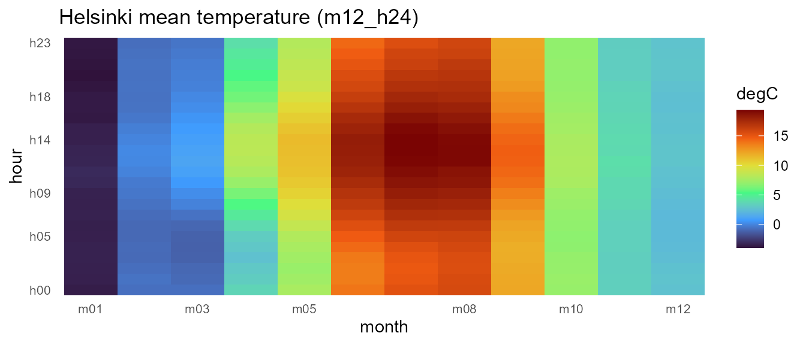

## Recasting across calendars

Timeslice-keyed panels recast between any two calendars, and identifier
columns like `city` are preserved as grouping columns — the same
mechanics that let mixed pipelines chain
`x |> recast_calendar(...) |> recast_geoscale(...)`. Aggregate all three
cities onto `m12_h24`, then move the panel across resolutions:

``` r

panel <- merra2_cities |>
  mutate(timeslice = datetime_to_timeslice(datetime, cal)) |>
  summarise(across(c(T10M, W50M), mean), .by = c(city, timeslice))

# month x hour -> quarter x hourtype (cross-cutting hierarchies)
panel |>
  recast_calendar(cal, calendars$q4_hp3, year = 2019,
                  rule = "weighted_mean") |>
  head(6)
#>   timeslice    city      T10M     W50M
#> 1    Q1_DAY Beijing  2.541667 5.709537
#> 2    Q2_DAY Beijing 21.282967 5.738462
#> 3    Q3_DAY Beijing 25.997283 4.445924
#> 4    Q4_DAY Beijing  5.854167 4.850725
#> 5  Q1_NIGHT Beijing  1.844444 5.310000
#> 6  Q2_NIGHT Beijing 21.416209 4.363736

# ... and to the seasonal view
panel |>
  recast_calendar(cal, calendars$s4, year = 2019,
                  rule = "weighted_mean") |>
  filter(city == "Helsinki")
#>   timeslice     city       T10M     W50M
#> 1       WIN Helsinki -0.4689815 7.659907
#> 2       SPR Helsinki  4.8949275 5.947328
#> 3       SUM Helsinki 16.7771739 5.337862
#> 4       FAL Helsinki  7.9001832 6.448352
```

Conservation under `rule = "sum"` holds per identifier group. Treating
mean irradiance as an extensive proxy (energy per timeslice), each
city’s annual total survives the trip to `"ANNUAL"`:

``` r

irr <- merra2_cities |>
  mutate(timeslice = datetime_to_timeslice(datetime, cal)) |>
  summarise(SWGDN = sum(SWGDN), .by = c(city, timeslice))

irr |>
  recast_calendar(cal, to = "ANNUAL", year = 2019, rule = "sum")
#>    timeslice      city   SWGDN
#> 1     ANNUAL   Beijing 1685648
#> 2     ANNUAL Cape Town 1972784
#> 3     ANNUAL     Dakar 2267102
#> 4     ANNUAL     Delhi 1954674
#> 5     ANNUAL  Helsinki 1100819
#> 6     ANNUAL  Honolulu 2250778
#> 7     ANNUAL   Jakarta 1961284
#> 8     ANNUAL      Lima 2352652
#> 9     ANNUAL    Lisbon 1847102
#> 10    ANNUAL Reykjavik 1004032
#> 11    ANNUAL    Sydney 1921049
#> 12    ANNUAL     Tokyo 1623462

# identical to summing the timeslice panel directly:
irr |> summarise(SWGDN = sum(SWGDN), .by = city)
#>         city   SWGDN
#> 1    Beijing 1685648
#> 2  Cape Town 1972784
#> 3      Dakar 2267102
#> 4      Delhi 1954674
#> 5   Helsinki 1100819
#> 6   Honolulu 2250778
#> 7    Jakarta 1961284
#> 8       Lima 2352652
#> 9     Lisbon 1847102
#> 10 Reykjavik 1004032
#> 11    Sydney 1921049
#> 12     Tokyo 1623462
```

## One resource, three calendars

Model design is choosing a resolution. The same Reykjavik wind year on
three calendars of decreasing size — the full month × hour grid, one
representative day per quarter, and four seasons × three hour-types —
shows exactly what each compression keeps. (The spatial twin of this
figure — one wind resource at three map resolutions — lives in the
[geoscales visualization
article](https://optimal2050.github.io/geoscales/r/articles/visualization.html).)

``` r

rey <- merra2_cities |> filter(city == "Reykjavik")
for (id in c("m12_h24", "q4_h24", "s4_hp3")) {
  cal_i <- calendars[[id]]
  w <- rey |>
    mutate(timeslice = datetime_to_timeslice(datetime, cal_i)) |>
    summarise(W50M = mean(W50M), .by = timeslice)
  print(calendar_plot(cal_i, w, palette = "G") +
          labs(title = paste("Reykjavik wind on", id), fill = "m/s"))
}
```

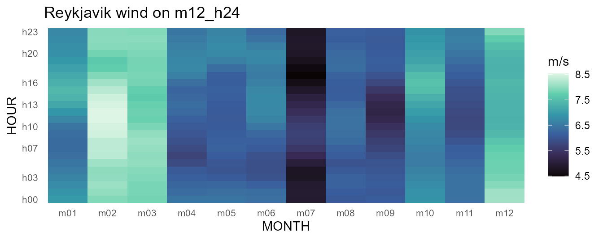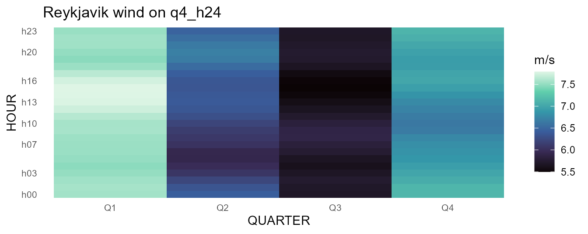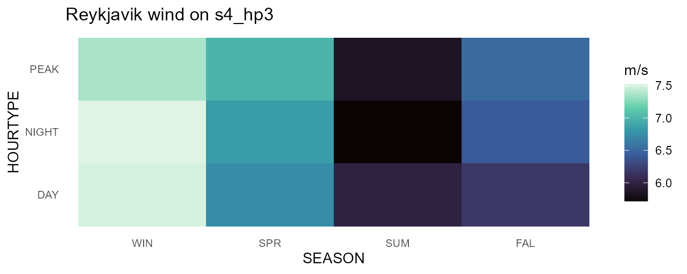

## Profiles: lines over timeslices

Because timeslices come back as ordered factors, line plots need only
`group=`. The same temperature series at monthly resolution for all
three cities:

``` r

panel |>
  select(city, timeslice, T10M) |>
  recast_calendar(cal, to = "MONTH", year = 2019,
                  rule = "weighted_mean") |>
  ggplot(aes(timeslice, T10M, color = city, group = city)) +
  geom_line(linewidth = 1) +
  scale_color_viridis_d(option = "H", end = 0.8) +
  labs(x = NULL, y = "degC",
       title = "Monthly mean temperature, 2019") +
  theme_calendar()
```

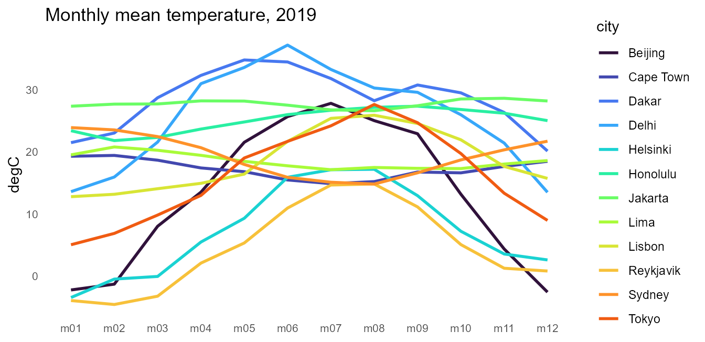

Diurnal profiles by season come from recasting to `s4_h24` and letting
[`join_calendar()`](https://optimal2050.github.io/timescales/r/reference/join_calendar.md)
attach the timeframe columns (prefixed by the calendar’s name, so
several calendars can coexist on one dataset):

``` r

panel |>
  recast_calendar(cal, calendars$s4_h24, year = 2019,
                  rule = "weighted_mean") |>
  join_calendar(calendars$s4_h24, timeframes = TRUE) |>
  ggplot(aes(`s4_h24.HOUR`, T10M,
             color = `s4_h24.SEASON`, group = `s4_h24.SEASON`)) +
  geom_line(linewidth = 0.8) +
  facet_wrap(~city) +
  scale_color_viridis_d(option = "D", end = 0.85) +
  scale_x_discrete(breaks = calendar_breaks(5)) +
  labs(x = "hour (UTC)", y = "degC", color = "season",
       title = "Seasonal diurnal temperature profiles, 2019") +
  theme_calendar()
```

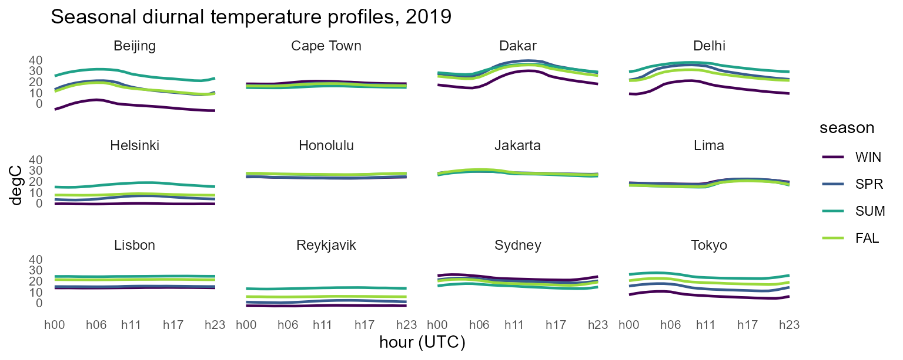

## Ranges: ribbons

Roll-your-own composition is plain ggplot. Monthly temperature envelopes
— hourly extremes around the mean — are one grouped
[`summarise()`](https://dplyr.tidyverse.org/reference/summarise.html)
and a
[`geom_ribbon()`](https://ggplot2.tidyverse.org/reference/geom_ribbon.html):

``` r

merra2_cities |>
  mutate(timeslice = datetime_to_timeslice(datetime, calendars$m12)) |>
  summarise(lo = min(T10M), hi = max(T10M), avg = mean(T10M),
            .by = c(city, timeslice)) |>
  mutate(timeslice = factor(timeslice,
                            levels = calendars$m12@members$MONTH)) |>
  ggplot(aes(timeslice, group = city)) +
  geom_ribbon(aes(ymin = lo, ymax = hi, fill = city), alpha = 0.3) +
  geom_line(aes(y = avg, color = city), linewidth = 1) +
  scale_fill_viridis_d(option = "H", end = 0.8) +
  scale_color_viridis_d(option = "H", end = 0.8) +
  labs(x = NULL, y = "degC",
       title = "Temperature envelopes (hourly extremes), 2019") +
  theme_calendar()
```

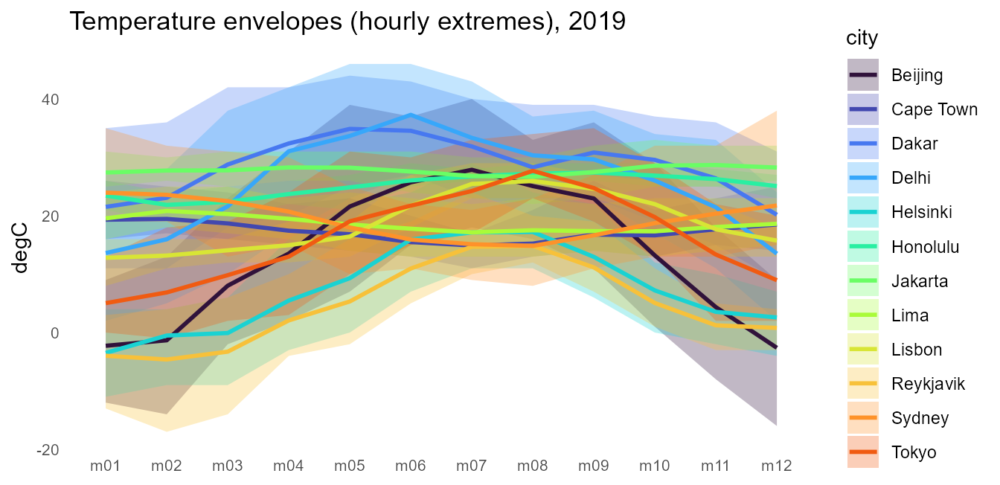

## Duration curves

The classic energy view: values sorted descending against cumulative
duration. Shares make the x axis honest — `join_calendar(meta = TRUE)`
attaches each timeslice’s share of the year, and the cumulative share
times 8760 is hours:

``` r

panel |>
  select(city, timeslice, W50M) |>
  join_calendar(cal, meta = TRUE) |>
  arrange(city, desc(W50M)) |>
  mutate(hours = cumsum(m12_h24.share) * 8760, .by = city) |>
  ggplot(aes(hours, W50M, color = city)) +
  geom_step(linewidth = 0.8) +
  scale_color_viridis_d(option = "H", end = 0.8) +
  labs(x = "hours per year", y = "m/s",
       title = "Wind speed duration curves (m12_h24), 2019") +
  theme_calendar()
```

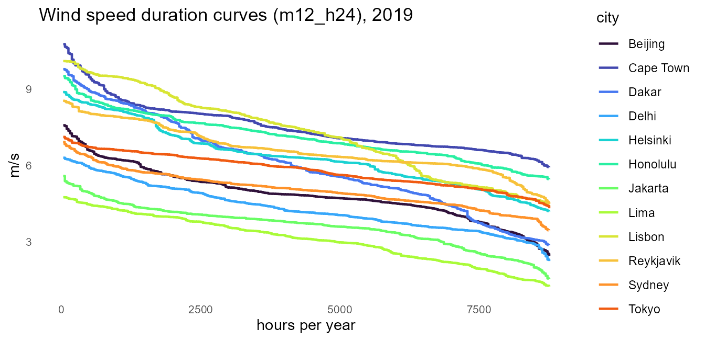

## Structure figures

The assembled counterparts need no data at all.
[`calendar_autoplot()`](https://optimal2050.github.io/timescales/r/reference/calendar_autoplot.md)
(also
[`autoplot()`](https://ggplot2.tidyverse.org/reference/autoplot.html)/[`plot()`](https://rdrr.io/r/graphics/plot.default.html))
draws the calendar’s structure as an icicle, and
[`calendar_plot()`](https://optimal2050.github.io/timescales/r/reference/calendar_plot.md)
is the one-call heatmap over the same layout machinery:

``` r

calendar_autoplot(calendars$m12_h24)
```

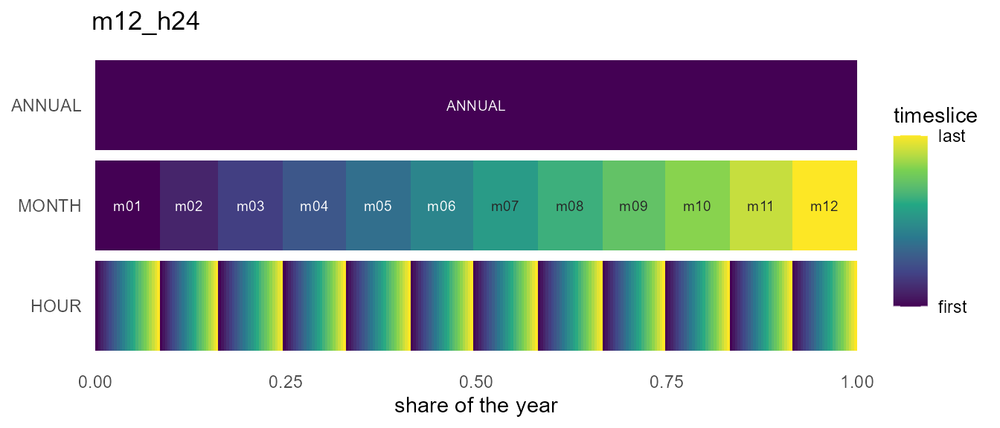

``` r

calendar_plot(calendars$m12_h24, hel_timeslices, palette = "H")
```

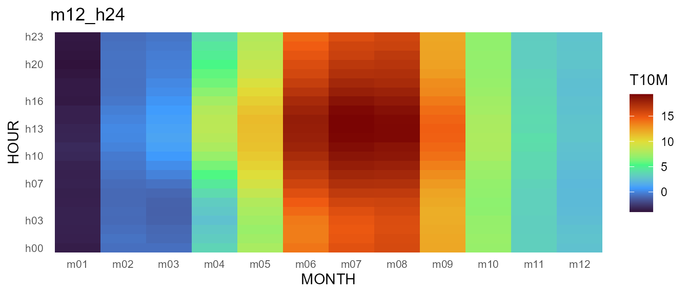

Their shared geometry is available without ggplot2 via
[`calendar_layout()`](https://optimal2050.github.io/timescales/r/reference/calendar_layout.md);
the wall form’s frames come from
[`calendar_wall_layout()`](https://optimal2050.github.io/timescales/r/reference/calendar_wall_layout.md)
and
[`calendar_weekdays()`](https://optimal2050.github.io/timescales/r/reference/calendar_weekdays.md)
— all plain data frames, ready for whatever figure this vignette did not
anticipate.

## The stack view

`type = "stack"` draws the same structure axonometrically — one plane
per timeframe, `ANNUAL` on top, each plane segmented at the true
duration shares. Points of view come as presets (`view =` `"oblique"`,
`"top-down"`, `"cavalier"`, `"cabinet"`, `"military"`, `"isometric"`,
`"dimetric"`, `"trimetric"`, `"perspective"`), with `rotate =` and
`direction =` to turn and flip the stack; `frame =` draws each plane’s
sheet, `frame_fill =` tints it like glass, and `connectors =` adds the
corner guides that keep the projection readable:

``` r

calendar_autoplot(calendars$s4_hp3, type = "stack",
                  frame = TRUE, connectors = TRUE,
                  frame_fill = alpha("grey60", 0.12))
```

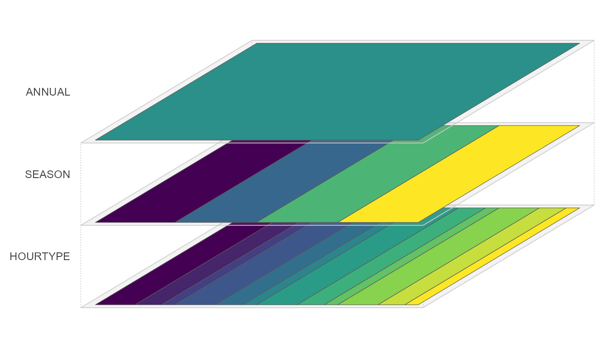

The stack also takes data. `data`/`z` hand a timeslice-keyed value to
the plot, and every plane receives it recast to its own timeframe
(`rule =` and `year =` are the
[`recast_calendar()`](https://optimal2050.github.io/timescales/r/reference/recast_calendar.md)
arguments; the base grid is hourly by default), so the whole stack
shares one continuous scale — the annual mean on top, the finest
resolution at the bottom. `labels =` names timeframes whose member names
are written on the plane, and `palette = NULL` lets you attach your own
fill scale:

``` r

calendar_autoplot(cal, type = "stack",
                  data = hel_timeslices, z = "T10M",
                  rule = "weighted_mean", year = 2019,
                  labels = "MONTH",
                  colour = c("grey35", "grey35", NA),  # no borders on the
                  frame = TRUE,                        # dense HOUR plane
                  frame_fill = alpha("grey60", 0.10)) +
  labs(fill = "degC")
```

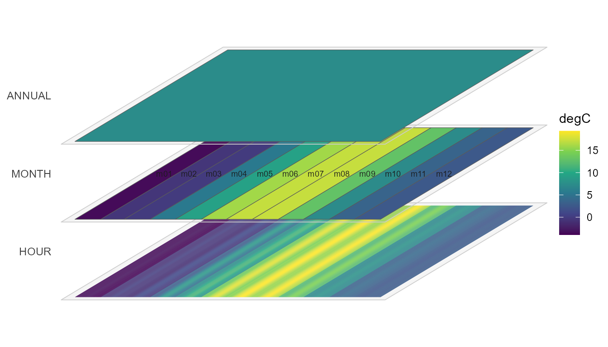

## Fiscal figures

Member order flows into every axis and facet automatically. On the
`fy04_*` calendars (Indian fiscal year: April..March, see
[`vignette("calendars")`](https://optimal2050.github.io/timescales/r/articles/calendars.md))
the wall facets and every axis start in April with no plotting changes
at all — and because the wall knows the real dates, its facets carry the
Gregorian year (`APR 2019 .. MAR 2020`), making the rollover explicit.
The sample covers calendar 2019, so fiscal 2019 has its last quarter
empty — filter to the fiscal window first, or Jan-Mar 2019 would land on
the Jan-Mar 2020 slots:

``` r

hel_fy <- hel |>
  filter(datetime >= as.POSIXct("2019-04-01", tz = "UTC"))

calendar_wall_plot(calendar("fy04_d365"), hel_fy, z = "SWGDN",
                   year = 2019) +
  scale_fill_viridis_c(option = "H") +
  labs(fill = "W/m2",
       title = "Helsinki solar irradiance, fiscal 2019 (Apr-Mar)")
```

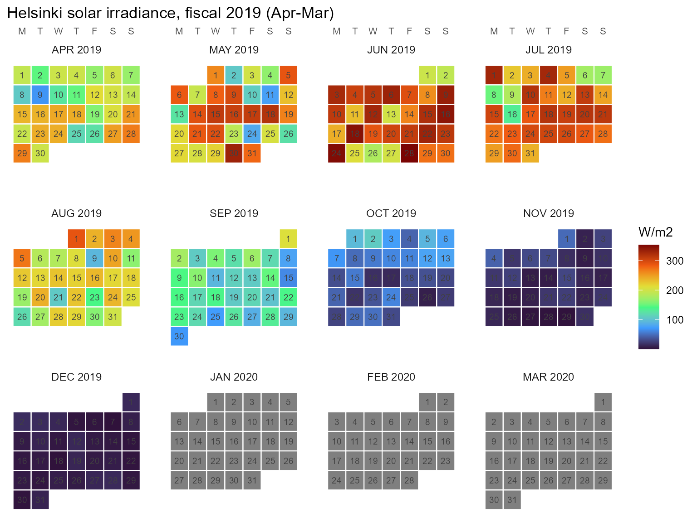

For value axes, label the fiscal months with their calendar year — the
axis runs `Apr 2019 .. Mar 2020`:

``` r

fy <- calendar("fy04_m12")

fy_axis <- tibble(timeslice = fy@members$MONTH) |>
  mutate(m = as.integer(sub("^m", "", timeslice)),
         label = paste(month.abb[m], if_else(m >= 4L, 2019L, 2020L)),
         label = factor(label, levels = label))

hel_fy |>
  mutate(timeslice = datetime_to_timeslice(datetime, fy)) |>
  summarise(SWGDN = mean(SWGDN), .by = timeslice) |>
  left_join(fy_axis, by = "timeslice") |>
  ggplot(aes(label, SWGDN)) +
  geom_col(fill = "#1AE4B6") +   # turbo (viridis H) at ~0.35
  scale_x_discrete(drop = FALSE) +   # keep the empty Jan-Mar 2020 slots
  labs(x = NULL, y = "W/m2",
       title = "Helsinki mean solar irradiance, fiscal 2019") +
  theme_calendar(axis.text.x = element_text(angle = 45, hjust = 1))
```

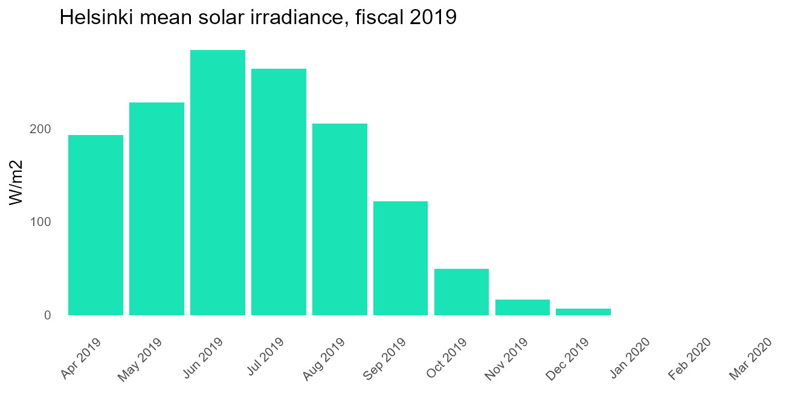

For the spatial dimension, the sibling package geoscales draws region
hierarchies and choropleths the same way (whole-plot
`geoscale_plot()`/`geoscale_autoplot()` over `geoscale_layout()`); see
its “Plotting geoscales” article. `geom_calendar*()` is the stack’s only
composable geom family — spatial maps facet and dissolve rather than
layer.
