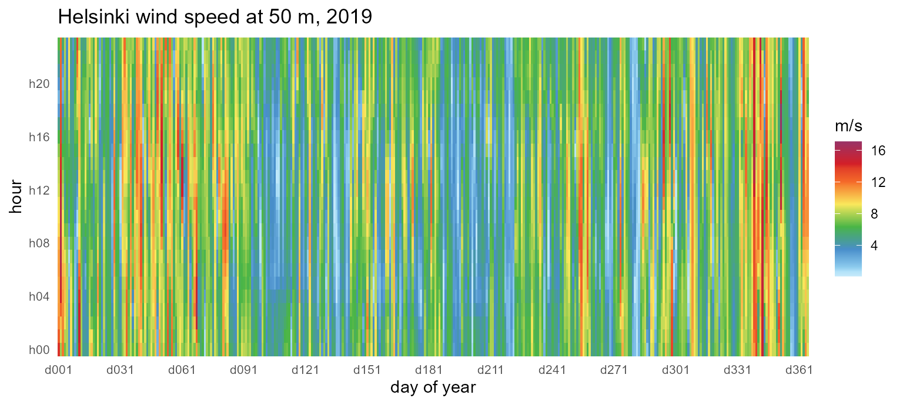
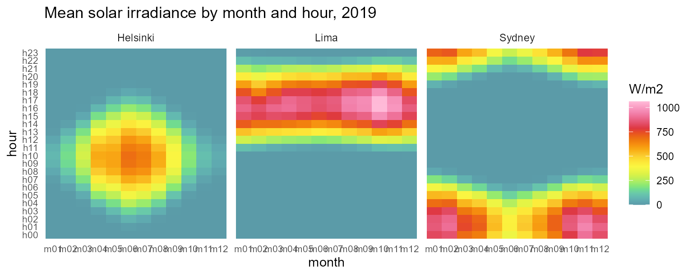
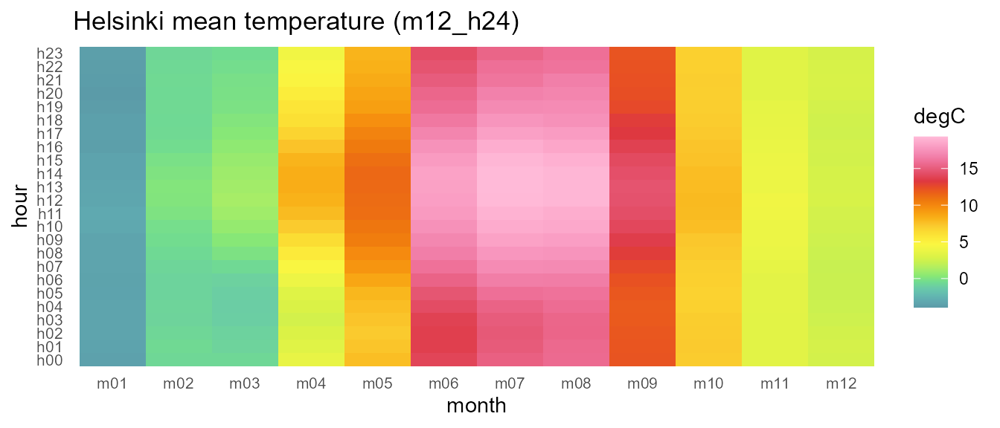
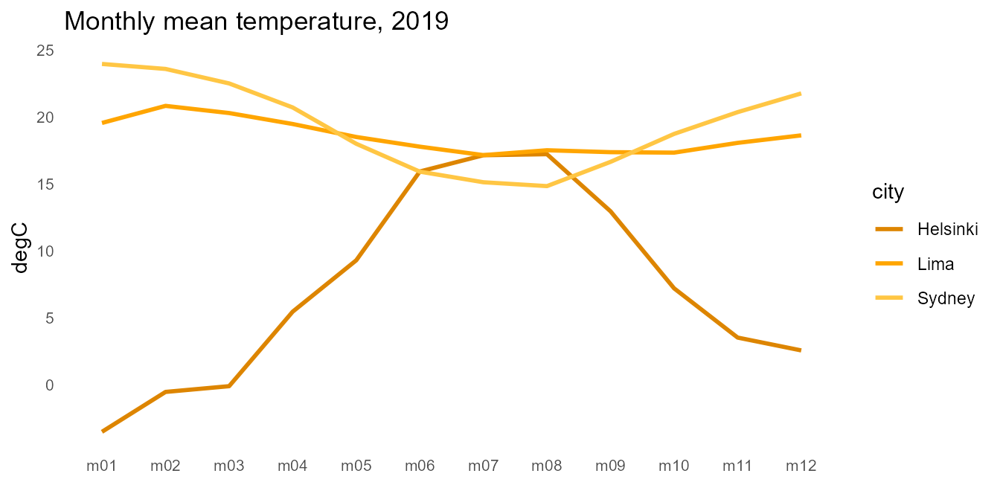

# Weather data on calendars

## The sample

`merra2_cities` ships three contrasting hourly weather series for 2019 —
Helsinki (high latitude), Lima (equatorial), Sydney (southern
hemisphere) — extracted from NASA’s MERRA-2 reanalysis:

``` r

str(merra2_cities)
#> 'data.frame':    26280 obs. of  5 variables:
#>  $ city    : chr  "Helsinki" "Helsinki" "Helsinki" "Helsinki" ...
#>  $ datetime: POSIXct, format: "2019-01-01 00:30:00" "2019-01-01 01:30:00" ...
#>  $ T10M    : num  1 2 2 3 3 3 3 3 3 3 ...
#>  $ W50M    : num  14 12.6 11.5 11 10.8 ...
#>  $ SWGDN   : num  0 0 0 0 0 0 0 0 2 13 ...
```

Instants are stamped at 30 minutes past the hour (the MERRA-2
hourly-mean convention);
[`instant_to_timeslice()`](https://optimal2050.github.io/timescales/r/reference/instant_to_timeslice.md)
floors them into hourly timeslices, so no preprocessing is needed.

## Datetime data on a calendar

[`geom_calendar()`](https://optimal2050.github.io/timescales/r/reference/geom_calendar.md)
cuts a datetime column to timeslices and aggregates into tiles. Helsinki
wind on the full-resolution `d365_h24` calendar, with energypal’s Global
Wind Atlas ramp:

``` r

hel <- subset(merra2_cities, city == "Helsinki")
ggplot(hel) +
  geom_calendar(calendar = calendars$d365_h24,
                datetime = "datetime", z = "W50M") +
  energypal::scale_fill_energy_c(palette = "windatlas") +
  scale_x_discrete(breaks = sprintf("d%03d", seq(1, 365, by = 30))) +
  scale_y_discrete(breaks = sprintf("h%02d", seq(0, 23, by = 4))) +
  labs(x = "day of year", y = "hour", fill = "m/s",
       title = "Helsinki wind speed at 50 m, 2019") +
  theme_calendar()
```



The representative-day view compresses the same year into `m12_h24`
(month x hour), and the `by=` argument carries the `city` column through
aggregation so facets work. Times are UTC, so each city’s solar noon
sits at its longitude’s offset (Lima ~16h, Sydney ~01h — a calendar with
`utc_offset_minutes` shifts this to local time):

``` r

ggplot(merra2_cities) +
  geom_calendar(calendar = calendars$m12_h24,
                datetime = "datetime", z = "SWGDN", by = "city") +
  facet_wrap(~city) +
  energypal::scale_fill_energy_c(palette = "solaratlas_ghi") +
  labs(x = "month", y = "hour", fill = "W/m2",
       title = "Mean solar irradiance by month and hour, 2019") +
  theme_calendar()
```



## Timeslice-keyed data

Once data lives on timeslices,
[`geom_calendar_tile()`](https://optimal2050.github.io/timescales/r/reference/geom_calendar.md)
draws it directly, and
[`join_calendar()`](https://optimal2050.github.io/timescales/r/reference/join_calendar.md)
attaches timeframe columns for manual workflows:

``` r

cal <- calendars$m12_h24
hel$timeslice <- instant_to_timeslice(hel$datetime, cal)
hel_timeslices <- aggregate(T10M ~ timeslice, data = hel, FUN = mean)

ggplot(hel_timeslices) +
  geom_calendar_tile(calendar = cal, z = "T10M") +
  scale_fill_gradientn(colours = energypal::energypal("solaratlas_ghi")) +
  labs(x = "month", y = "hour", fill = "degC",
       title = "Helsinki mean temperature (m12_h24)") +
  theme_calendar()
```



(energypal deliberately ships no temperature palette; the solar-atlas
ramp is borrowed here and labeled as such.)

## Recasting across calendars

Timeslice-keyed panels recast between any two calendars, and identifier
columns like `city` are preserved as grouping columns — the same
mechanics that let mixed pipelines chain
`x |> recast_calendar(...) |> geo_recast(...)`. Aggregate all three
cities onto `m12_h24`, then move the panel across resolutions:

``` r

all3 <- merra2_cities
all3$timeslice <- instant_to_timeslice(all3$datetime, cal)
panel <- aggregate(cbind(T10M, W50M) ~ city + timeslice, data = all3,
                   FUN = mean)

# month x hour -> quarter x hourtype (cross-cutting hierarchies)
q_hp <- recast_calendar(panel, cal, calendars$q4_hp3, year = 2019)
head(q_hp, 6)
#>   timeslice     city      T10M     W50M
#> 1    Q1_DAY Helsinki -1.138889 7.495926
#> 2    Q2_DAY Helsinki 11.371795 5.333059
#> 3    Q3_DAY Helsinki 16.717391 5.346830
#> 4    Q4_DAY Helsinki  4.586051 7.106793
#> 5  Q1_NIGHT Helsinki -1.723611 7.328056
#> 6  Q2_NIGHT Helsinki  8.390110 5.440247

# ... and to the seasonal view
seasonal <- recast_calendar(panel, cal, calendars$s4, year = 2019)
seasonal[seasonal$city == "Helsinki", ]
#>   timeslice     city       T10M     W50M
#> 1       WIN Helsinki -0.4689815 7.659907
#> 2       SPR Helsinki  4.8949275 5.947328
#> 3       SUM Helsinki 16.7771739 5.337862
#> 4       FAL Helsinki  7.9001832 6.448352
```

Conservation under `rule = "sum"` holds per identifier group. Treating
mean irradiance as an extensive proxy (energy per timeslice), each
city’s annual total survives the trip to `"ANNUAL"`:

``` r

irr <- aggregate(SWGDN ~ city + timeslice, data = all3, FUN = sum)
annual <- recast_calendar(irr, cal, to = "ANNUAL", year = 2019,
                          rule = "sum")
annual
#>   timeslice     city   SWGDN
#> 1    ANNUAL Helsinki 1100819
#> 2    ANNUAL     Lima 2352652
#> 3    ANNUAL   Sydney 1921049
# identical to summing the timeslice panel directly:
tapply(irr$SWGDN, irr$city, sum)
#> Helsinki     Lima   Sydney 
#>  1100819  2352652  1921049
```

## Comparing resolutions

The same temperature series at monthly resolution for all three cities,
with `energypal_gradient()` spreading one carrier color into related
tones (the levels aren’t energy carriers, so explicit colors sidestep
the label matcher):

``` r

m_t <- recast_calendar(panel[c("city", "timeslice", "T10M")], cal,
                       to = "MONTH", year = 2019)

tones <- energypal::energypal_gradient(
  energypal::energypal("carriers")[["Solar"]], n = 3)

ggplot(m_t, aes(timeslice, T10M, color = city, group = city)) +
  geom_line(linewidth = 1) +
  scale_color_manual(values = unname(tones)) +
  labs(x = NULL, y = "degC",
       title = "Monthly mean temperature, 2019") +
  theme_calendar()
```


